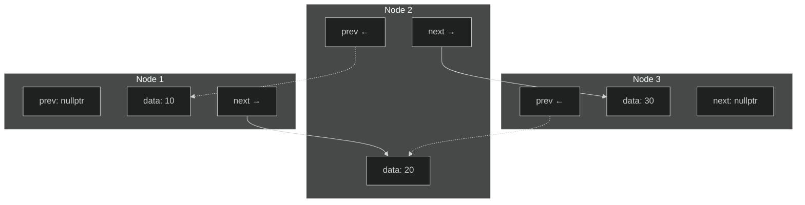
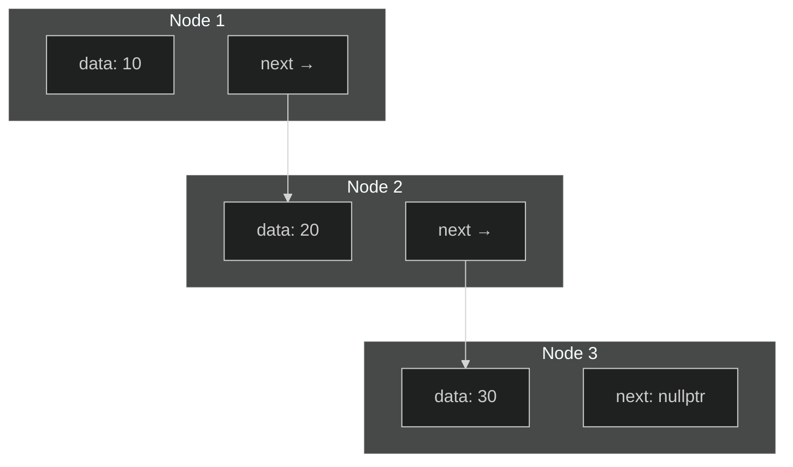

In STL presented 3 types of container:
* *Sequential containers* - data is stored in an order which is determined by the program. The order doesn't depend on its value and data will remain in the same position unless the program performs some action which changes them (move, reallocation etc). 
Those containers are `std::array`, `std::vector`, `std::list`, `std::forward_list`, `std::deque`, (`std::implace_vector` and `std::hive` which planned in C++26), from some perspective `std::string`,  (and `std::valarray`, `std::initializer_list`, `std::bitset` but they don't have iterators).
* *Associative containers* - data order depends on the data to provide better search (using red-black tree or hash tables). 
In C++ provided two types of associative containers, `std::set` which have only sorted unique keys and `std::map` which represents pair key-value. Beside that exist  `unorded_` modification, which uses hash tables for keys for faster search, but not sorted (`std::unorded_map`, `std::unorded_set`). And also exists multi-modification, (`std::multiset`, `std::multimap`, `std::unorded_multiset`, `std::unorded_multimap`), which allow non-unique keys. 
* *Containers adapters* - provide some different interface using sequential containers.
Examples are `std::stack`, `std::queue`, `std::priority_queue`, `std::flat_set`, `std::flat_map`, `std::flat_multiset`, `std::flat_multimap`. 


## Sequential containers
### Built-in array
C++ has a inherited from C array. 
`{cpp} int arr[] = {1, 2, 3};`
It's faster than `std::vector`, directly compatible with C code, can be allocated both on heap and stack. 
But it have serious disadvantages: 
* No direct way to find number of elements, either store separately or calculate each time.
* "Silent" conversion to pointer.
* Arrays can't be assigned ti each other.

### std::array
>[!code-ref]
>```cpp
>template<class T, std::size_t N> 
>struct std::array;
>```

`std::array` is  a templated wrapper for Built-in arrays, defined in `<array>`. 

`std::array` require two template arguments, elements type and number of elements. Number of elements also part of the object and using an array with wrong number of elements (for example, in function argument parameter) will give a compiler error. It has a similar interface to STL containers, while retaining the speed of build-in arrays, doesn't automatically decay to pointer, retains information about its size and supports iterators. 

An `std::array` object can only be created on the stack, number of elements must be known at compile time, a contiguous block of memory will be allocated to store the elements.
Unlike other containers, the default constructor creates a fully-sized object with default-initialized elements, while other containers 'empty'.

Starting from C++17 it's possible to skip template parameter specification when providing initial values in initialization, complier will use template argument deduction. 
```cpp
#include <array>

std::array<int, 5> arr {1, 2, 3, 4, 5};
std::array f_arr {1.0f, 2.0f, 3.0f, 4.0f, 5.0f};
```

Iterators of `std::array` are *Random Access Iterators* and *Contiguous Iterators* (from C++20 also *Contexpr Iterators*). 

#### Member functions
>[!code-ref] `{cpp} operator=(std::array other)` 
> Overwrites every element if the array with the corresponding elements of another array 

>[!code-ref]+ `{cpp} std::size_t .size()`
>Returns number of elements 
>
>Complexity - $O(1)$

>[!code-ref] `{cpp}bool .empty()`
> Return `true` if container is empty.
> 
> Complexity - $O(1)$

>[!code-ref] `{cpp} T& operator[](std::size_t pos)` / `{cpp}const T& operator[](std::size_t pos) const`
> Access element by index without bounds checking.
> 
> Complexity - $O(1)$
> Never inserts a new element into the container. 

>[!code-ref] `{cpp}std::size_t .max_size() const`
> Return maximum number of elements (`N`)
> 
> Complexity - $O(1)$

>[!code-ref] `{cpp}T& at(std::size_t pos)` / `{cpp}const T& at(std::size_t pos) const`
>Access element by index with bounds checking. 
>
> Complexity - $O(1)$
>Throw `std::out_of_range` exception. 

>[!code-ref] `{cpp}T& .front()` / `{cpp}const T& .front() const`
>Get first element
>
>Complexity - $O(1)$
>Equivalent to `{cpp}*arr.begin()`
>*UB* for empty container.

>[!code-ref] `{cpp}T& .back()` / `{cpp}const T& .back() const`
>Get last element. 
>
>Complexity - $O(1)$
>Equivalent to `{cpp}*std::prev(arr.end())`.
>*UB* for empty container.

>[!code-ref] `{cpp}T* .data()` / `{cpp}const T* .data() const`
> Return a pointer to underlying array (C-style array)
> 
>Complexity - $O(1)$

>[!code-ref] `{cpp}void .fill(const T& value)`
> Assign all elements to `value`
> 
>Complexity - $O(N)$

>[!code-ref] `{cpp}void .swap( std::array& other)`
> Swaps the content of the containers with `other`.
> 
>Complexity - $O(N)$.
> `{cpp}noexcept(std::is_nothrow_swappable_v<T>)`

>[!code-ref]+ Get iterators, support all type of iterators
> * `iterator`: `{cpp}.begin()` and `{cpp}.end()`
> * `const_iterator`: `{cpp}.cbegin() const` and `{cpp}.cend() const`
> * `reverse_iterator`: `{cpp}.rbegin()` and `{cpp}.rend()`
> * `const_reverse_iterator`: `{cpp}.crbegin() const` and `{cpp}.crend() const`
> 
>  Complexity - $O(1)$

#### Non-member functions
>[!code-ref] Lexicographical elements compare, all variations of `std::operator...`
>Complexity - $O(1)$

>[!code-ref] `{cpp} T& get<I>(std::array a)`/`{cpp} T&& get<I>(std::array a) const`/`{cpp} const T& get<I>(std::array a)`/`{cpp} const T&& get<I>(std::array a) const`
>Extract `I` element using tuple-like interface. 
>
> Using `std::` namespace not required, can be used for both set and get values. 
> ```cpp
> std::array<int, 5> arr {1, 2, 3, 4, 5};
> get<0>(arr) = 6, get<1>(arr) = 0; // set arr[0] and arr[1]
> ```
> Complexity - $O(1)$

>[!code-ref] `{cpp} std::array std::to_array<T>(T (&a)[N])` / `{cpp} std::array std::to_array<T>(T (&&a)[N])` _(C++20)_
>Create `std::array` from C-array. 
>```cpp
>auto a1 = std::to_array("foo"); // size() == 4 since also contain null-terminator
>auto a2 = std::to_array({0, 2, 1, 3});
>auto a3 = std::to_array<long>({0, 1, 3});
>```


### Lists
#### std::list
The C++ Standard Library `std::list` is implementation of double-linked lists. 

In a double-linked list each node has a link to the previous node as well as to the next node. Memory stored not contiguous. A double-linked list can be easily traversed backwards and forwards by the following the pointers in each node. 
Inserting and removing elements done via changing corresponding `next`/`prev` pointers.


List of some Pros and Cons:
* Adding or removing elements from the middle of a list is faster than for `std::vector`
* List are useful where we expected to add or remove a lot of elements frequently. 
* List don't support indexing or subscript notation, it doesn't support random access. 
* Accessing an element is slower than for `std::vector`
* List use more memory to store an element than `std::vector`.

##### Member functions 
>[!code-ref] `{cpp} .push_back()` / `{cpp}.push_front()`
> Add element to the end/beginning of container. 

>[!code-ref] `{cpp}void/std::size_t .remove(const T& value)`, `{cpp}void/std::size_t .remove_if(UnaryPred p)`
> Remove elements equal to given `value` or satisfy unary predicate `p`.
> Since C++20 return number of elements removed. 
> 
> Compare to generic `std::remove` actually remove elements, not moving them to end. 
> 
> Complexity: $O(N)$

>[!code-ref] `{cpp} void .sort(Compare comp = operator<)`
> Sort the elements in order based on `comp` operator. 
> 
> Generic `std::sort()` will not work with `std::list` since it's require Random Access Iterators. For sorting only available member function. 
> 
> Complexity $O(N* logN)$

>`.reverse`
> Reverse the order of the elements 

>`.unique()`
>Deletes duplicate elements from the list

>`.merge(std::list& other)` 
> Remove elements from the argument list and perform stable merge them into `this` list. 
> 
> Method expect *sorted* lists. If one of container is not sorted - *UB*. 

> `.splice()`
> Moves elements from another list or one element into a list.
> 
> All elements from another list will be inserted before given iterator. 

#### std::forward_list
`std::forward_list` is non-contiguous sequential container representing one-directional list implementation. 


In a list, each element has its own memory allocation "node", each node contains data and pointer to next node. To iterate through a list, we start with the first node, get its link pointer and go to the address in that link pointer, which is location of the second node. To add element required to create a node for it, make the link from the node before point to the new node, then make the new node's link point to the node after. Removing an element require to make the previous node link point to the next node. 

`std::forward_list` doesn't have `{cpp}insert()` or `{cpp}erase()` member functions, instead used `{cpp}insert_after()` and `{cpp}erase_after()`. 

Also instead `{cpp}.splice()` from `std::list`  `std::forward_list` implements `{cpp} .splice_after()` member functions. It's work similarly, but elements are spliced in after the iterator argument instead of before it. 

#### Note about choosing
Lists are much slower than vector and deque for most operations, uses more memory. However list is much faster at adding and removing elements, but only if this doesn't involve searching (meaning that when iterators known before inserting or deleting element). Also, changing element doesn't invalidate other iterators and pointers. 
> `std::forward_list` have less resources consumptions than `std::list`:  less memory per node, less action on insertion.

### std::deque 
`std::deque` implements a double-ended queue, defined in `<deque>`

Similar to a vector, but elements can also be adde efficiently both at the front and at the end. (In `std::vector` inserting into front will trigger shifting all elements to the right, which cost $O(N)$. Also, inserting into `std::vector` at the end not always $O(1)$ - in some cases capacity can be not enough and `std::vector` will perform reallocation, which will move all elements from old allocation to new. In `std::deque` *inserting in both front and back always O(1)*)

`std::deque` implemented as two-dimension array - it has multiple memory block which each store several elements. Memory storage *not contiguous*.  Iterating from the first element of the first block to the last element of the last block will return all the elements in order. If there is not enough room to store a new elements, the deque will allocate memory block and store new elements in there. The existing elements remain where they are.

Interface is similar to `std::vector`, in addition also have `{cpp}.push_front()` member function which inserts an element before the first block. 

> `std::queue` is container adapter, typically uses `std::deque` or `std::list`. So, if `std::forward_list` is 'stripped off version with half of functionality for reducing overhead', `std::queue` is not lightweight version. 


#### Note about choosing 
Deque is slightly slower than vector for most operations. However, it is faster than vector for adding and removing elements at the front of the container. Deque doesn't invalidate *references when inserting/removing last or first element*, however iterators might be invalidated and references when modifying  middle of container. 

## Associative containers
### Tree Data Structure
C++ associative containers are implemented using  tree-structure. This is a data structure in which each element has its own node, a node has a _key_ for the element and two pointer  _left_ and _right_. The positions of elements depends on the relative values of their keys: "left" points to an element which has a lower key, "right" points to an element which has a higher key. 

Main advantage of this data structure is that search for key is much faster (usually $O(logN)$). Also adding element is fast enough since it's require similarly to list require only to allocate new node and assign correct pointers. As disadvantage trees can after several inserting and erasing become "unbalanced", meaning slowing operation and might require rebalancing. This problem solved in 'balanced trees' which automatically rebalance themselves when needed, examples are "Red-black tree" or "AVL tree".

## std::set
A `std::set` from `<set>` is an minimalistic implementation of associative container in STL with only key. It's an unstructured collection of elements, all elements are unique and sorted with `{cpp}operator<` by default. To meet standart requirements it's implemented as *red-black tree*.

`std::set` doesn't have `{cpp}.push_back()`/`{cpp}.push_front()` functions (since elements not in order they inserted), instead  for elements insertion  used `{cpp}.insert()`.  For removing element used member function `{cpp}.erase()`. Before inserting/removing element `std::set` can check is tree is balanced, if not - rebalance tree firstly before operation. 

The elements in `std::set` are `const`, since container itself maintain order meaning that changing elements can break that order. This also implies some limitations on algorithms compatible with `set`. 

Attempt to insert element which already exist will fail.  `{cpp}.insert()` also return `{cpp}std::pair<itr, bool>`, second element of pair is flag "was element inserted" and first is iterator to inserted element or existing element if insertion failed. Starting from C++17 it's possible to use structured binding for returned pair:
```cpp
std::set ids {0, 100};

auto [itr, isInserted] = ids.insert(100);
if (!isInserted)
	std::cout << "ID already exists\n";
```

`{cpp}.find(k)` member function returns an iterator to the element with key `k` or `{cpp}.end()` if `k` is not found. Also can be used `{cpp}.count(k)` to check is `k` exist in set or not - function return the number of elements with key, but since duplicates not allowed, this can only be 0 or 1.

### Notes about choosing 
`std::set` relatively fast at accessing an arbitrary element ($O(logN)$, since require to iterate tree from root). Insertion and deletion are usually very fast ($O(logN)$). Useful for checking membership or removing duplicates, automatic sorting and removing duplicates.
> However filling `std::set` for only sorting purposes is equal to `std::vector` + `std::sort`,  both $O(N log N)$ 


## std::map
`std::map` is an associative container provided in `<map>`. Each element consists of an `{cpp}std::pair<Key, Value>`. Each element must have a unique key, elements are stored in order using `operator<` by key. For efficiency usually implemented as *red-black tree*.

The "value" member of the pair is used to store the data, values can repeat, only keys must be unique. The "key" is used to locate the corresponding data, it's used for look up the data in the value member and used in `{cpp}.operator[]`/`{cpp}.at()` member functions, so key acts like an index, but key have any type. 

To insert new element we need to make pair first. It'a either `{cpp}.insert(std::make_pair(k, v))` or using C++11 initializer list `{cpp}.insert({k, v})`. Similarly to `std::set` insertion return pair with iterator of element and flag, which will be false if we try to insert key which already presented. 

Also similarly to set, we can use `{cpp}.find()` and `{cpp}.count()` member functions, similarly key is `const`.

Unlike list and set, `std::map` supports subscripting (meaning that `{cpp}operator[]` available) , however this works differently from vector and arrays. If key not would in `std::map` when assigning value - *new element will be created*, if element does exist, this overwrites its value.  

Inserting with `{cpp}operator[]` has own disadvantages. Value type must have default initialization, from operation itself we can't tell is element was overwritten or created. Also if exception thrown - we can end up with key which has invalid data. So it's recommended to use `{cpp}.insert()` and check - if it's failed - using returned operator modify value. In C++17 also available `{cpp}.insert_or_assgin()`, which works as `{cpp}opertator[]`, but return `std::pair`, exception has no effect on insertion and value doesn't need to have a default constructor. 

Similarly to set, for std::pair handful to use structured bindings (C++17). Structured bindings useful not only for inserting values, but also in range-for loop since during iterating we will get `std::pair`. 
```cpp
std::map<std::string, int> counter {{"apple", 0}, {"banana", 0}};
counter["apple"]++;
for (const auto& [name, count] : counter)
	std::println("{} have {} elements", name, count);
```
> Important thing - key in pair always constant. Using `const auto [k, v]` can create copy, since auto will deduct type `k, v`, not `const k, v`.  With references it works correctly and no redundant copy is made. 

### Notes about choosing 
As for `std::set`, insertion, finding and erasing have complexity $O(log N)$, and since both use red-black tree, unique sorted keys - characteristics are same. Maps useful for indexed data (contact list, employee records, database query results etc), for storing data which is in the form of key-value pairs (JSON, XML, etc). 