Error handling is more related to handling errors at runtime, when the environment doesn't behave as expected (for example, trying to read file that doesn't exist, trying to send data over a network connection that is down etc.). 

When an error occurs, we need to communicate with the user to tell what the problem is and what they can do about it, give opportunity to retry, resolve or ignore (if possible), notify other concerned parties (for example network administrators in some cases). 

Often, errors can be handled where they occur (for example when asking user for an input and provided input have incorrect format). But sometimes it's useful to handle errors in a different part of the code (error handlers) to not mix up error handling code with some abstract/low-level code (for example, when working with network and want to handle connection error with GUI message box - creating message box and displaying it in the network library mean redundant dependencies, possible code duplication, also debugging can become complicated since it might become difficult to find in which function message box was created).  A better approach is to have these errors handled at a higher level, by for example passing error from the place where the error occurred to the code that will handles it.  

## Error codes and Exceptions
To handle errors on higher levels we need somehow transfer information about errors. 

In C, the only way to communicate an error condition is with an _error code_: the function returns a coded number that corresponds to the error and the caller checks the return value. The caller can handle itself error, pass it to its own caller or return a different error code. 
```c
int get_data(){
	... 
	if (!file)
		return ERR_FILE_NOT_FOUND;
}

int retval = get_data();
switch (retval) {
	...
	case ERR_FILE_NOT_FOUND:
		// Handle error code 
		break;
}
```

Error codes make the code more complicated. Every potential error situation requires an if statement, a return statement and perhaps clean-up code (for allocated memory). The caller has to check the return value against every error that the function could return. 
Error codes often cause maintenance problems:
- Large switch statements which need to be kept up-to-date and in sync, 
- Adding a new error requires changes to other parts of the code. 
- Some type safety should be taken in mind during design (enum classes and accidental type conversations). 
- Error codes don't work well with callback functions 
- C++ constructors cannot return an error code. 

C++ provides _exceptions_. 
Code which could cause a run-time error is put inside its own scope. If an error occurs, in run-time will be created an _exception object_ and execution will be left from current scope. Then will be found some _exception handler_ depending on the exception's type. 
The programmer specifies the type of the exception object and provides a handler for it, specifies when to create the exception. And the compiler will generate the code to create the exception object and invoke the correct handler for it. 

From advantages: 
+ Exceptions avoid a lot of tedious and error-prone coding. The compiler and the runtime will take care of the control flow, type system prevents from using the wrong handler, no switch statement and no error codes to maintain.
+ An exception object can convey more information than a number. 
+ Constructors and callbacks can throw exceptions as well. 
+ If there is no suitable handler, the program terminates immediately.

However, there are disadvantages. 
- Handling exceptions require extra code to be executed at run-time. 
- Throwing an exception takes much longer than returning an error code. (However, on modern hardware there almost no performance penalty on normal execution flow where exception didn't throw)
- In some environments, the overhead from exceptions is not acceptable
- Some C++ coding standards forbid using exceptions. 
- Some extra care required for resource managing (throwing an exception can create dangling pointers, memory leaks etc).

C++ not always by default use exceptions since C++ required to work in environments without exceptions as well. For example, 
```cpp
std::vector<int> vec{1};
std::cout << vec[2]; // Will crash program due to accesing memory out of range 
std::cout << vec.at(2); // Will throw an exception `std::out_of_range`. Since there is no error handler provided - execution will be terminated. 
```

Any type can be used fort an exception object, including built-in types. 
In C++98 was added the `std::exception` class which provides a consistent interface to exceptions.  `std::exception` is actually a base class of an inheritance hierarchy, it has a number of sub-class (like `std::out_of_range`), and also has a `{cpp} what()` virtual member function which returns a C-style string with error description. 

## Try and Catch blocks 
The exception mechanism requires some code to manage exceptions at runtime. This code is added by the compiler, but we need to tell the compiler to generate it. To do this, we put code that can throw an exception into _try-catch block_. Firstly, we put  `try {}` with followed after new scope of execution, and after that scope we put `catch() {}` keyword block with type of exception we are going to handle in brackets after and code to handle exception. 
```cpp
try {
    foo();
}
catch (const std::exception& e) {
    handle(e);
}
```

>[!note] Although it looks like function call/functor - it actually neither of it and is language specific syntax. 
> Compiler will generate something like this (pseudo-c++)
> ```cpp
> // Register try block in exception table
> register_try_block(start_of_try, end_of_try, handler_table);
> 
> foo();
> if (exception_thrown) {
> // Search entry in exception table
>    if (type_matches(exception, std::exception)) {
>        e = exception; // creating/copy exception object
>        handle(e);     // executing catch body
>    } else {
>        propagate_exception();
>    }
>}
>```

A `catch` block can only come after a `try` block (and also there is nothing come in between `try` and `catch`).  We can have more than one `catch` block for the same `try` block for handling exception with different static types.  If we put `std::excetion` base class in brackets - we gonna catch any possible  `std::exception`-inherited exception (for that will be used dynamic binding in runtime).  The exception will be handled by the first `catch` block that can handle it.  We can also put a `try-catch` inside another `try` block. 
```cpp
try {
	std::cout << vec.at(2);
}
catch (const std::out_of_range& e) {
	std::cout << "Out of range\n";
}
catch (const std::exception& e) {
	std::cout << e.what() << '\n';
}
```

When an exception is thrown, the thrown object is copied into a special area of memory (which is not part of the local stack). This area is set up by the compiler, it's accessible by any catch block which can handle the object type. The program immediately leaves this scope, without executing any further instructions and start looking for a `catch` block that can handle the exception. If it cannot find one, it will immediately destroy all local variables and exit the current scope. It then looks in the enclosing scope. This continues until it finds a suitable handler. If it reaches `{cpp}main()`  without finding one, the program calls `{cpp}std::terminate()`.  This process of repeatedly destroying local variables and exiting the current scope is known as _stack unwinding_. 
*Local variables will be destroyed in every scope until found suitable handler*.

When a suitable handler is found, the program executes the code in it and continues. Normally, it will proceed to the next instruction after the `catch` block and continue execution from there. 

We can also write a handler which can catch any type of exception with `{cpp} catch(...)` block. It's good for fall-back options in `catch` hierarchy. All-catch doesn't capture Unix signals and windows "structured exceptions", also it can make debugging more complicated - allowing the debugger to trap the exception instead will give more useful information (like call-stack to investigate where exception was thrown). 
```cpp
try {
    ...
}
catch (const NetworkConnectionError& e) { /* handler code */ }
catch (const std::bad_alloc& e) { }
catch (const std::exception& e) {}
catch (...) { /* Unhandled exception */}
```

If catch `std::exception` by-value - static binding will be used and used it's `{cpp}what()` which just says that this is and `std::exception`.  Thus it's better to catch exception objects by reference, this allows polymorphism to work (also preferable to use `const` reference).  

When the program is executing in a `catch` block, this implies that something unusual might happen, program might be in unstable state. it's better to avoid allocating memory, creating new variables. Never execute anything that might throw a new exception.  

## Exceptions throwing 
To create a exception object and start stack unwinding used keyword `throw` with an expression after it. Any object and any type can be thrown, for example `{cpp}throw 123;` or `{cpp}throw std::runtime_error("error");`

The handler can rethrow the exception, in this case the exception will be handled again in next suitable handler. 
To rethrow the same exception object can be used `throw` keyword with no argument. If give an argument, it will throw a copy of that object. Since exception is thrown outside the current `try` block, the program will regard this as a completely new exception and start fresh stack unwinding process.  
Rethrowing exceptions can e used to log the exception at the point where it happens, add extra information to the exception or convert the exception to a higher level type. 

Since during stack unwinding for all local variables called destruction, it's not a good idea to throw an exception from destructor. If exception is not handler by destructor exception will "leak" and can start two stack unwind operation at the same time, which is UB. *Destructors should never throw exceptions*. Or at least handle exceptions inside destructor if it's required. 

For constructors, it's pretty opposite - an exception thrown in a constructor should be left for the caller to handle. If handle exception inside constructor - object probably ill-formed. It's up to caller to decide how to handle situation, since in that case two possible outcomes: either no exception and a successfully created object or an exception is thrown and there is no object.


## std::exception hierarchy
C++ defined a base class `std::exception` which defines consistent interface for exception object. This also allows to take advantage of polymorphism to design handlers which catch exception y reference and can proceed with multiple subclasses. 

```mermaid 
---
config:
  theme: dark
  look: classic
---
flowchart TB
std::exception --> std::logic_error
    std::logic_error --> std::out_of_range
    std::logic_error --> std::domain_error
    std::logic_error --> std::invalid_argument
    std::logic_error --> std::length_error
    std::logic_error --> std::future_error
std::exception --> std::bad_cast
    std::bad_cast --> std::bad_any_cast
std::exception --> std::bad_typeid
std::exception --> std::bad_optional_access 
std::exception --> std::bad_expected_access 
std::exception --> std::bad_weak_ptr
std::exception --> std::bad_function_call 
std::exception --> std::bad_alloc
    std::bad_alloc --> std::bad_array_new_length 
std::exception --> std::bad_exception 
std::exception --> std::bad_variant_access 
std::exception --> std::runtime_error
    std::runtime_error --> std::overflow_error 
    std::runtime_error --> std::underflow_error
    std::runtime_error --> std::range_error
    std::runtime_error --> std::regex_error
    std::runtime_error --> std::system_error
        std::system_error --> std::ios_base::failure
        std::system_error --> std::filesystem::filesystem_error 
    std::runtime_error --> std::chrono::ambiguous_local_time
    std::runtime_error --> std::chrono::nonexistent_local_time
    std::runtime_error --> std::format_error 
```



A logic error represents something that is under the control of the programmer (e.g. violating a precondition). It's errors which could be prevented by the programmer.
A runtime error represent something that is beyond the programmer's direct control (e.g. running out of memory)

Commonly used `std::exception` subclasses:
+ `std::bad_alloc` - thrown when a memory allocation fails 
+ `std::bad_cast`  thrown when a dynamic_cast fails 
+ `std::out_of_range` - attempting to access an element outside a defined range in container 
+ `std::invalid_argument` - the argument to a function is not acceptable (e.g. passing a non-numeric argument to `{cpp}std::stoi()`
+ `std::domain_error` - the argument to a function is outside the domain of applicable values (e.g. invalid data field)
+ `std::length_error` - the length limit of an object is exceeded (e.g. appending too many elements to a string)
+ `std::overflow_error` - the result of computation is too large for the result variable
+ `std::underflow_error` - the result of a floating-point computation is too small for the result variable 
+ `std::range_error` - an internal computation gives a value which cannot be represented by the result variable 

`std::exception` defines five public member functions 
* constructor `{cpp}std::exception() noexcept;`
* copy constructor `{cpp}std::exception(const std::exception& other) noexcept;`
* virtual destructor `{cpp}virtual ~exception();`
* assignment operator `{cpp}std::exception& operator=(const std::exception& other) noexcept;`
* `{cpp}virtual const char* what() const noexcept;`

Exceptions which have a default constructor: 
`{cpp}std::exception`, `{cpp}std::bad_alloc`, `{cpp}std::bad_cast`, `{cpp}std::bad_any_cast`, `{cpp}std::bad_optional_access`, `{cpp}std::bad_typeid`, `{cpp}std::bad_weak_ptr`, `{cpp}std::bad_function_call`, `{cpp}std::bad_array_new_length`, `{cpp}std::bad_exception`, `{cpp}std::bad_variant_access`

The other don't have a default constructor, but have a constructor that takes an argument for information about the error conditions (which will be also returned by `{cpp}what()`). 
+ `{cpp}std::future_error(std::future_errc);`
+ `{cpp}std::regex_error(std::regex_constants::error_type);`
+ `{cpp}std::system_error(std::error_code);`
    + `{cpp}std::system_error(std::error_code ec, const std::string& what_arg);`
    + `{cpp}std::system_error(std::error_code ec, const char* what_arg);`
    + `{cpp}std::system_error(int ev, const std::error_category& ecat);`
    + `{cpp}std::system_error(int ev, const std::error_category& ecat, const std::string& what_arg);`
    + `{cpp}std::system_error(int ev, const std::error_category& ecat, const char* what_arg);`
+ `{cpp}explicit std::ios_base::failure(const std::string& message, const std::error_code& ec = std::io_errc::stream);`
    + `{cpp}explicit std::ios_base::failure(const std::string& message, const std::error_code& ec = std::io_errc::stream);`
+ `{cpp}std::filesystem::filesystem_error(const std::string& what_arg, std::error_code ec);`
    + `{cpp}std::filesystem::filesystem_error(const std::string& what_arg, const std::filesystem::path& p1, std::error_code ec);`
    + `{cpp}std::filesystem::filesystem_error(const std::string& what_arg, const std::filesystem::path& p1, const std::filesystem::path& p2, std::error_code ec);`
+  `{cpp}std::chrono::nonexistent_local_time( const std::chrono::local_time<Duration>& tp, const std::chrono::local_info& i);`
+  `{cpp}std::chrono::ambiguous_local_time( const std::chrono::local_time<Duration>& tp, const std::chrono::local_info& i);`
+ `{cpp}explicit std::bad_expected_access(E e);`
*  Other - takes `std::string` or `const char*`

Not all C++ standard functions throw an exception. Also C++ streams don't throw exception by default - error conditions can be checked by the stream state/error bit. But exceptions can be optionally enabled, however the resulting code is usually more complex
```cpp
ifile.exceptions(std::ifstream::failbit | std::ifstream::badbit);
try {
    ifile.open("text.txt");
}
catch (const std::ios_base::failure& e) {
    std::cout << e.what();
}
```

## Custom exception class 
We can write our own exception classes. Usually it's best to derive from one of the subclasses of `std::exception` .

A custom exception class need constructor which take both `std::string` and C-style string. Constructor argument can be simply passed to a constructor of inherited class.
It needs a copy constructor, which can be inherited or defaulted. A custom class can override the `{cpp}what()` member function. It can have data members to store information relevant to the error condition, recommended to use only built-it types, keep it light weight. Also since program in unstable state - better to perform minimal processing. And not throw a fresh exception. percentage 

```cpp
class bad_percentage : public std::out_of_range {
public:
    bad_percentage() : std::out_of_range("Invalid percentage value") {}
    bad_percentage(const char* s) : std::out_of_range(s) {}
    bad_percentage(const std::string& s) : std::out_of_range(s) {}
    
    bad_percentage(const bad_percentage& other) = default;
    bad_percentage& operator=(const bad_percentage& other) = default;
};
```

Standard exceptions presented in `<stdexcept>` header. 

## Exception Safety 
Exception safety means that code behaves correctly when exceptions are thrown. 

There are three main exception guarantees: 
+ *Basic* exception guarantee - if an exception is thrown during an operation, no resources are leaked, files opened during the operation will be closed, memory allocated during the operation will be released. All the operations and function in STL provide the basic guarantee. 
+ *Strong* exception guarantee - if an exception is thrown, the program reverts to its previous state as if the operation had not happened, all iterators or references to remain valid. This also known as transactional semantics (similar to commit and rollback in databases). All operations on STL containers provide the strong exception guarantee. 
+ *No-throw* guarantee - the code doesn't throw any exceptions. 

When writing code that provides some level of guarantees, it's helpful to know that a sub-operation will not throw. Basically none of the functions and operations in the core C++ language and library throw exceptions, apart from `new`, `dynamic_cast`, `throw`. 

C++98 provided the `throw()` exception specifier. This comes after the function's parameter list and the argument list are the exceptions that the function could throw. If function is throwing an exception which is not in the list, the program will be immediately terminated. Empty argument list indicates that the function doesn't throw (or suppose to) any exceptions.  
```cpp
void func() throw(NetworkConnectionError, DataError) {
}
```
Problem with this approach is that list of exceptions is not checked by the compiler and if list is incorrect - the program will just unexpectedly crash. 
`throw()` is *deprecated* and removed completely in C++20.

In C++11 was added`noexcept` keyword instead. It's equivalent to `throw()` with empty list. If exception is thrown - program will be terminated immediately. Is same promise to the caller that the function will not throw an exception. `noexcept` helps the compiler generate better code (for example, compiler can skip generation code for stack unwinding, use modern STL `noexcept` function otherwise select older but safer function, it's a case for move semantics for example). 
A function must either be `noexcept` or not be `noexcept`, we can't declare both versions. If a `virtual` function is `noexcept` in the base class, overrides in the derived class must also be `noexcept`. If in base class function `noexcept`-ness, child class can override it and made `noexcept`, but not in another way, child can't remove it. Inheriting constructors will be `noexcept` if the base class constructor is `noexcept`, as well as synthesized special be `noexcept` in inherited class automatically. The compiler also will assume a class's destructor is `noexcept` if all member of the class have a `noexcept` destructor and all parent classes have a `noexcept` destructor. This allows existing code to benefit from having `noexcept` destructors, with no modification, but it's better to write explicitly.

>However, compiler can't check is code promised to be `noexcept` is really doesn't throw an exception. Also swallowing exception to provide exception-free function might mean redundancy with fake guarantee - not good practice and probable also should be noted when using function, which promised by someone about `noexcept`

To keep exception safety it's better to use RAII classes for resources management - this helps keep basic guarantee. Also useful technique is "Copy and Swap" - `std::swap` is `noexcept`, if we created a copy of object without exception we can safely swap it to avoid dangling/half-invalid objects. 
> [[Chapter 4 - Design and Declarations#Item 25 Consider support for a non-throwing swap.| Good explanation provided in Item 25 from Effective C++]]


## Swap and copy
> [[Chapter 4 - Design and Declarations#Item 25 Consider support for a non-throwing swap.]]
`swap` function is a mainstay of exception-safe programming and a common mechanism for coping with the possibility of assignment to self. 

When writing a copy operators we need to check against self assignment, also if between deleting internal member and assigning to it value from argument object thrown exception - we getting invalid object with probably garbage in it. Swap and copy solve both issues. providing safe and simple control over resources management. 

STL provide generic `{cpp} std::swap() nothrow`, it simply copies its arguments. There are overload for library types which take advantage of their internal structure (for example, swapping only pointers instead performing deep copy). 

If own class is expensive to copy and its objects could be swapped in more efficient way - it worth to write overload of `{cpp}std::swap()`. Own overload should also be `noexcept`, probably declared as `friend` to access private and protected members, or delegate to a member function (like `{cpp}internal_swap(T& other)`), also by `inline` compiler might optimize away the function call. 
```cpp
class String { 
private:
	int size;
	char* data;
	
	friend swap(String& lhs, String& rhs) noexcept;
};
inline void swap(String& lhs, String& rhs) noexcept { 
	std::swap(lhs.size, rhs.size);
	std::swap(lhs.data, rhs.data);
}
```

## Not mentioned part 
>[!note] At least in scope of course not mentioned about  _conditional noexcept_, partially described in [[Chapter 3 - Moving to Modern C++#Item 14 Declare functions `noexcept` if they won't emit exceptions.|Item 14 from Effective Modern C++]]

