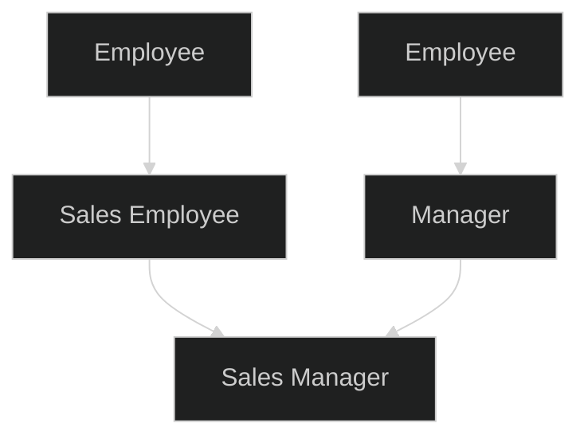

## Chrono Library 
C++ inherited from C time library, it's defined in `<ctime>`. It's a low-level and poorly designed. 
In C++11 added the `std::chrono` library for time-handling, from C++20 it's also can handle dates. The `std::chrono` library from `<chrono>` more precise and provide more rich interface, although it quite complicated. 

Traditional C time library provide several functions and types for working with time
+ `{cpp}std::clock_t std::clock()` - return the number of "clock ticks" since the program started. Can be used for intervals of up to few minutes (about 36 minutes), precision is implementation-defined, usually 1 microsecond.  Result conversion to seconds possible via  divide it by `CLOCKS_PER_SEC`.  Return -1 if processor time used is not available, If the value of the processor time used cannot be represented by std::clock_t, returns an *unspecified value*.
+ `{cpp} std::time_t std::time(std::time_t* arg)` - return current calendar time encoded on success, -1 on error. If `arg` is not `nullptr`, the return value is also stored in the object pointed to by `arg`. `std::time_t` represents a number of seconds since 1970. Can be used for longer intervals (up to several decades). Precision is around 1 sec. 

`std::chrono` library provide 3 main concepts: 
+ Clock - start date (epoch) and tick rate. It's corresponds to the return value form calling `{cpp}std::time()`.
+ Time point - the number of clock since the epoch , at a given point in time 
+ Duration - an interval between two time points, measured in clock ticks.

`std::chrono` also define some _duration units_, used to measure time intervals. C++14 also provide literals for units available with`{cpp} using namespace std::literals`/`{cpp} using namespacestd::chrono_literals` 
+ `std::chrono::nanoseconds`; `80ns`
+ `std::chrono::microseconds`; `50us`
+ `std::chrono::milliseconds`; `20ms`
+ `std::chrono::seconds`; `2s`
+ `std::chrono::minutes` `10min`
+ `std::chrono::hours`; `5h`
+ `std::chrono::days` (since C++20); `15d`
+ `std::chrono::weeks` (since C++20); 
+ `std::chrono::months` (since C++20); 
+ `std::chrono::years` (since C++20); `2000y`
Duration units are default-initialized, if variable is not value-initialized, then its value is undefined (similarly to built-in types).

To get number value of the duration used `{cpp} count()` member function. In general it's should be used only for I/O and interfacing to legacy code. 

Constructors and conversion operators of duration units are `explicit` to avoid implicit conversion from int or different time units when slicing can happen 
```cpp
std::chrono::hours h{1};    // OK
std::chrono::hours h = 1;   // Error
std::chrono::hours h = 1h;  // OK

std::chrono::hours h = 65min; // Error, 5 min can be lost
std::chrono::minutes h = 2h;  // OK
```

`{cpp} std::chrono::duration_cast<>` allow to make explicit conversions between different duration units.
```cpp
std::chrono::hours h = std::chrono::duration_cast<std::chrono::hours>(65min);
```

There are 3 clocks in `std::chrono`:
+ `std::chrono::system_clock` - measures "wall time" using the hardware system's clock.
	+ It's the best clock relate to calendars, watches, etc since matches the user's view of time. 
	+ Not good for measuring time intervals - occasional adjustments for daylight saving, changes can cause even backwards jumps 
+ `std::chrono::steady_clock` - idealized clock which only goes forward, one tick at time. 
	+ Best clock for measuring time intervals, since can't jump around and only goes forward, one tick at time. 
+ `std::chrono::high_resulution_clock` - clock with the shortest tick period. Implementation-defined, usually an alias to one of 2 clock above.


`std::chrono::time_point` class represents a point in time. This contains a duration representing the time interval since the clocks's "epoch". 
A `time_point` object associated with  particular clock. Calling the clock's `{cpp}now()` function will return a `time_point` object. 
We can add or  subtract a `time_point` and a duration object. 

> There lots of information not mentioned since _C++20_ not just added support of Dates, but also time zones, overload for `operator<<` which makes clocks member function `count()` almost useless, new types of utility clocks (utc, gps, file clocks), `std::chrono::parse()` to parses a chrono object from a stream.  


## std::bitset
C++ inherited from C operators for bitwise manipulation of integers  (like left shift etc).
In C++11 introduced `std::bitset` in `<bitset>` header - an abstraction which represent groups of bits. This provide much safer and easier way to operate bit operation compare to legacy C operations. 

`std::bitset` is a templated type, it's type parameter is the number of bits to create. `std::bitset` can be initialized from _unsigned_ integer (including hex, oct and bin literals), from `std::string`/`std::string_view`/`const char*` with optional argument starting position `pos`, length `n`, alternate values for `one` and unset `zero` bits.
```cpp
std::bitset<9> b1{"101011110"};
std::bitset<16> b2{0xae};
std::bitset<8> b3{0b1010'1110};
```

Bitsets have overload for `operator<<` (_not bit shifting_), meaning that they can be used with streams (like `std::cout`). There are also several member functions to access the data 
+ `{cpp}.to_ulong()` - returns data as `unsigned long`
+ `{cpp}.to_ullong()` - return data as  `unsigned long long`
+ `{cpp}.to_string()` - return data as `std::string`. 

The `{cpp}.size()` member function gives the number of bits in the bitset. It's also possible to use subscript (`{cpp}operator[]`) to access individual bits, indexing starts _from right to left_ (from Least Significant Bit). `{cpp}.test()` access a bit with bound checking (similar to `{cpp}.at()` in containers). 
```cpp
std::bitset<8> b1{0b1010'1110};
std::cout << b1[0]// Outputs 0
b1.test(8); // Throws std::out_of_range. 
```

We can also perform all usual binary operations, but be aware of [priority of operations](https://en.cppreference.com/w/cpp/language/operator_precedence.html), `operator<<` have greater priority than most bitwise operations.
```cpp
std::bitset<8> b1{"10101110"};
std::bitset<8> b2{"0101110"}; // since length in initializing string less than actual size 
                              // - result will be 00101110

std::cout << ~b1 << '\n';       // Displays 01010001
std::cout << (b1 & b2) << '\n'; // Displays 00101110
std::cout << (b1 | b2) << '\n'; // Displays 10101110
std::cout << (b1 ^ b2) << '\n'; // Displays 10000000
std::cout << (b1 << 4) << '\n'; // Displays 11100000
std::cout << (b2 >> 2) << '\n'; // Displays 00001011
```

Other member functions: 
+ Sets all bits to `true` or sets one bit to specified value. 
	+ without argument. `{cpp}.set()` - set all bits to `true` 
	+ with one argument `{cpp}.set(0)` - set bit 0 to `true`
	+ with two argument `{cpp}.set(0, false)` - set bit 0 to `false`;
+ Sets all bits or one specified to `false`. 
	+ `{cpp}.reset()` - set all to `false`
	+ `{cpp}.reset(4)` - set bet 4 to `false`
+ Invert all bits or one specified 
	+ `{cpp}.flip()` - invert all bits 
	+ `{cpp}.flip(4)` - invert bet 4
+ Return `true` if all bits are `true`
	+ `{cpp}.all()` 
+ Return `true` if at least one bit is `true`
	+ `{cpp}.any()`
+ Return `true` if all bits are `false`
	+ `{cpp}.none()`
+ Return number of bits equal to `true`
	+ `{cpp}.count()`

## std::tuple
C++11 provides an `std::tuple` type in `<typle>`, it's generally speaking `std::pair` with any fixed number of elements. 

Elements are accessed by index using  function `{cpp}std::get<Idx>(tupleObj)`, where in  template argument element's index and in function argument tuple object where get from. C++14 also allow to use the type as the template parameter (only for unique types in tuple). `{cpp}std::get` return reference to element, meaning that it can be also used to set value of tuple.
```cpp
std::tuple<double, int, std::string> numberThree{3.0, 3, "Three"s}
// or 
auto numberThree {std::make_tuple(3.0, 3, "Three"s)};
// from C++17 CTAD works with tuples
std::tuple numberThree{3.0, 3, "Three"s}

std::get<2>(numberThree) = "eq Thres";
std::cout << std::get<0>(numberThree) << ' ' << std::get<std::string>(numberThree);
```

It's possible to unpack all the elements in `std::tuple` into separate variables using `std::tie`. The number and type elements must match. `std::ignore` can be used to skip some elements unpacking.
From C++17 instead `{cpp}std::tie` can be used  structured binding, which makes work and variable initialization simpler. 
```cpp
int i;
std::string str;

auto numberThree {std::make_tuple(3.0, 3, "Three"s)};
std::tie(std::ignore, i, str) = numberThree;

// equal to 

std::tuple numberThree {3.0, 3, "Three"s};
auto [d, i, str] = numberThree;
```

`std::tuple` useful to return multiple values from function. Traditionally we would use a struct for it, but it require to create a struct with unique name in namespace, crate name for members, care about moving, copying etc. With tuple it's require less code with particularly same result.
```cpp
std::tuple<int, double, std::string> func() {
	return {2, 1.0, "Three"s};
}

std::tie(i, d, str) = func();
// or 
auto [i, d, str] = func();
```

In C++17 also added `{cpp}std::apply()` which takes as first argument callable object and as second argument `std::tuple`. Function will unpack tuple and pass it's element to callable function.
```cpp
void func(int i, double d, std::string str);

std::tuple numberThree {3, 3.0, "Three"s};
std::apply(func, numberThree);
```
Similarly, `std::tuple` can be passed to constructor call with `{cpp}std::make_from_tuple<T>()`
```cpp
struct Foo
{
    Foo(int first, float second, int third)
    {
        std::cout << first << ", " << second << ", " << third << '\n';
    }
};
 
int main()
{
    auto tuple = std::make_tuple(42, 3.14f, 0);
    auto fObj = std::make_from_tuple<Foo>(std::move(tuple));
}
```

## Unions
C++ inherited unions from C. A `union` is a compound data structure: each member must have a distinct type, all the members are stored at the same address, only one member can be in use at a time.  All members will be stored at the beginning of memory (while in struct members are stored one-by-one with some padding of required) and member memory storage will overlapping. Reason behind it for better space managing (for example, when working with networks packets, instead creating for different headers different structs - create union in which different header structure can overlap, but we still have type safety compare to `*void` or `std::reinterpret_cast`).

All the members of union are `public` by default, unions can have member functions, but not virtual member functions, can't be used as base or derived classes, only as PODs. 

If we assign to the one member, that member is no "in use", only one member can be in use at any one time, other members have undefined values, thus it's safe to read from a mmeber if it's currently in use. 
> But it's not restricted/prohibited. On of the use for unions - to have different representation of one memory. For example, [[Union|The Cherno in his Union video]] provided on great example: Vec4 union which have members for working with individual axes (`x`, `y`, `w`, `h`) and with pair `left` and `right` - after initializing pair, we can use union as replacement for `std::reinterpret_cast`

The main problem is that the programmer is expected to known which type is in use, making unions highly error-prone. Unions can be made safer by adding a "tag" member, which indicates which member is in use. This is known as a _tagged union_.
```cpp
enum class TokenType {Char, Int, Double};
struct Token {
    union {
        char c;
        int i;
        double d;
    };
    TokenType type;
};

Token token;
token.type = TokenType::Char;
token.c = 'Z';

if (token.type == TokenType::Char)
    std::cout << token.c << '\n';
```

Further more improvements include hiding union in private class area, type validation and throwing an exception. 

## std::variant
C++17 provides an alternative to tagged unions called `std::variant`. It's a type-safe, automatically calls constructor and destructors when required, simpler to use, allow to have different "alternatives" with the same type (which not possible with unions). 

To use `std::variant` we specify in template parameter required type, assign value to created object - compiler using type deduction choose proper alternative, to get an _alternative_ can be used `std::get()` similarly to `std::tuple`
```cpp
std::variant<char, int, double> v;
v = 'Z';

std::cout << std::get<char>(v);
// or by index 
std::cout << std::get<1>(v); // will thrown std::bad_variant_access since is use index 0, not index 1. 
```

We can call `{cpp}std::holds_alternative()` to check whether an alternative is in use. 

Unions and `std::variant` useful for parsing (where a variable can have one of several types), for optimizing memory usage, as return value with error handling (return either result or error type), probably for polymorphism in virtual function implementation.

> As was mentioned in [[variant (c++17)|The Cherno std::variant video]], while `union` allocate memory based on greatest member, `std::variant` allocate memory as summary of variants, so it's consume more memory, but in exchange we get type safety. There also member function `{cpp}.index()` which return currently used alternative, and conditional `{cpp}get_if<type>()`.

## Mathematical types
`{cpp}std::valarray` is a vector-like type based on Fortran arrays, It's fixed size array with some extra syntax for doing numerical operations like adding or dividing vectors.
However it's not used that much, regarded as poorly designed and compiler implementers are not interested in optimizing it. It's better to use a third-party library (like Eigen, Blaze, Armadillo etc)

`{cpp}std::complex` from `<complex>` is a templated type for complex numbers, as template parameter can be `float`, `double` `long double`. 
STL complex number member functions to get `{cpp}.real()` and `{cpp}.imag()` parts, complex numbers support IO streams for printing/reading values, they support usual arithmetic and logical operators (except pre-increment and post-increment)
C++14 provides additionally literal suffix `"i` which returns `std::complex` object with real part 0.0.

STL also contain non-member function to convert the complex number to and from polar coordinates:
+ `{cpp}std::abs()` - Returns the magnitude of the complex number, 
+ `{cpp}std::arg()` - Returns the phase angle in radians,  
+ `{cpp}std::conj()` - Invert imaginary part.
As well as some usual exponential, power and trigonometric functions (`{cpp}std::exp()`, `{cpp}std::log()`, `{cpp}std::pow()`, `{cpp}std::sqrt()`, `{cpp}std::sin()`, `{cpp}std::cos()` etc)

## std::bind
C++11 defines `std::bind` in `<functional>` header. `std::bind` takes a callable object as its first argument, performs a partial function call - it will bind its  remaining arguments to this function and return a new callable object. 

New callable object can take arguments as well, these are will be forwarded to original callable object.
To specify where these argument will appear used _placeholders_ defined in `std::placeholders` namespace. `_1` will be replace with first argument, `_2` with second etc.  Placeholder can be in different orders, like `{cpp}std::bind(func, _2, _1)`
`std::bind` can be useful for STL algorithms for example. 
```cpp
bool match(const std::string& animal, const std::string& species) {
	return animal == species;
}

auto match_cat = std::bind(match, _1, "cat");
// match_cat("dog") will similar to match ("dog", "cat");

std::vector<std::string> animal {"cat", "dog", "cat"};
std::cout << std::count_if(std::cbegin(animals), std::cend(animals), match_cat);
```

However, from C++14 example about can be achieved with lambda
```cpp
auto match_cat = [species = "cat"s](const std::string& animal) {
	return match(animal, species);
}
std::count_if(std::cbegin(animals), std::cend(animals), match_cat);
```


## Callable objects
A callable object is object which supports `operator()`. Typical example are pointers to non-member functions, functors, lambda expressions, objects returned from `std::bind()`. 

In C++11 added `std::function` in `<functional>` class. This  template class has a private member which stores a callable objects, template arguments are object's signature in format `{cpp}<return_type(function_argument)>`.
```cpp
int counter(const std::vector<std::string>& texts, 
            std::function<bool(const std::string&>) matcher) {
	unsigned int count{};
	for (const auto& text : texts)
		if (matcher(text))
			count ++;
	return count;
}

[](const std::string& animal) { return animal == "cat"; }
std::cout << counter(animals, [](const std::string& animal) { return animal == "cat"; });
```
Class implemented using inheritance and virtual functions, and class performs _type erasure_ - the object's original type cannot be recovered and only left `std::function` type. 

It's useful for using as function argument (since any kind of callable object can be passed to `std::function`), `std::function` also can be used to create a container with callable objects. 

There are some limitations. The function prototype must match the template parameter, it doesn't support overloading. There are some run-time overhead, invoking the callable object involves indirection (similar overhead to a virtual function). It's also consume some memory overhead, beside `std::function` object size (which is fixed), if the callable object is too large (e.g. functor with data members), it allocates the necessary memory on the heap.

`std::function` should only be used when we need a polymorphic function object. Fir storing a callable object in variable, better to use `auto`. 


## Member function pointers 
We can define a pointer to a member function of a class.

Their use is more complicated than with function pointers, it's require different syntax than for pointer to non-member functions, it's also require `this` pointer. Member function pointers can't be called directly unlike non-member function pointers, they must be explicitly dereferenced (so they not a callable objects).

For example we have class 
```cpp
class Test {
	void func(int a, const std::string& b);
};
```
To defined pointer to a member function used syntax 
`{cpp} void(Test::*pFunc)(int, const string&);`
To make defined pointer point to he member function,
`{cpp} pFunc = &Test::func; // & is NOT optional`
To call a member function pointer we need an object, access the pointer as a member of the object, then we dereference it with `{cpp}operator.*`, if instead object we have pointer to object - we can use `{cpp}operator->*`.
```cpp
Test test;
(test.*pfunc)(42, "Hello"s);

Test* pTest = &test;
(pTest->*pFunc)(42, "Hello"s);
```

C++11 features make working with member function pointer much simplier.
+ We can use `auto` to create the member function pointer 
	`{cpp} auto pFunc = &Test::func;`
+ We can use a type alias 
```cpp
using PFuncType = void (Test::*)(int, const string&);
std::vector<PFuncType> ptrs
```
+ `{cpp} std::mem_fn()` in `<functional>` can convert member function pointer to callable object, for using that object as first argument passed `this` pointer.

Member function pointers used in concurrency, run-time decision making: choose which  object is used, which member function is called. 

## Interfacing with C
C is an almost complete subset of C++, almost any C program is a legal C++ program, if C program doesn't use `class` as variable name for example or some C99 features - we can compile C program as a C++ program.

Interfacing with C at the binary level - require a header file which declares the function in the C interface and compiled binary code for the functions (either an object file or a library). Used  C and C++ compilers must be compatible (same object file format, same function convention, same word size (x86 or x64)). 

We need be aware of _name mangling_. In C, a function has the same name in the binary object as it does in the source code, while in C++ the compiler "mangles" name since C++ has function overloading, which C does not. 
For example 
`{cpp}int func(int x)` -> `__Z3func1i`
To make C++ binaries compatible with C, we use `{cpp}extern "C"` directive, which prevent C++ compiler from name mangling. 
```cpp
extern "C" { #include "cstuff.h" }
extern "C" int func();

extern "C" {
	int func();
	doub dfunc();
}
```

When writing a C++ function which will be called from C, in the interface we can use built-in type, can use arrays and pointer to built-in types, `struct` which have members of built-in types only. C has no concept of namespaces, so function should be in global namespace. 

To hide C++ code which is not supported by C compiler we can use `__cplusplus` preprocessor symbol 
```cpp
#ifdef __cplusplus
extern "C" // C++ code
#else  
...        // C code
#endif
```

Some STL container have member function which help convert their data to C compatible format. For example `std::string` and `std::vector` have `{cpp}.data()` member functions. Otherwise we can use STL algorithms to populate container (like `std::set` or `std::map`) 

## RTTI
Run-time type information (RTTI) relates to the dynamic type of the object. 

`{cpp}typeid()` returns information about the dynamic type of its argument, mainly used in comparisons.
```cpp
Circle d;
Shape* pShape = &d;

if (typeid(*pShape) == typeid(Circle))
	...
```
 `{cpp}typeid()` return a class object `std::type_info`, defined in `<typeinfo>` header. It contains information about the dynamic type of an object. 
+ `{cpp}.name()` member function return a  C-style string with mostly name of class which compiler use (for `std::string` about it can return `NSt7__cxx1112basic_stringIcSt11char_traitsIcESaIcEEE`)
+ `{cpp}.hash_code()` return a unique number for each dynamic type, it can be used for `unordered` containers 

`std::dynamic_cast` converts pointer to Base to a pointer to Derived. It allows to check at runtime whether a Base-to-Derived conversion is possible, if it's fails - cast return `nullptr`, for references it throw `std::bad_cast`. It also can be used for calling a member function that only exists in Derived class.

## Multiple inheritance 
In multiple inheritance, a derived class has more than one parent. It's controversial topic, since it adds complexity, some languages don't even support it. However, multiple inheritance can be useful for writing "mix-in" classes. 

The syntax is and extension of single inheritance, we put comma when specifying inheritance. 
```cpp
class HardwareDevice;
class TouchResponder;

class Mouse : public HardwareDevice, public TouchResponder {
... 
};
```

A derived class object is store in memory as the base class object followed by the derived class part. The base class objects are stored in the order they were listed, in this order also will be called constructors. 

If base classes have function with same names (excluding signature), this can be not clear which version to call. This can be avoided by adding a forwarding function to the child 
```cpp
void Mouse::initialize(Params& params) {
	TouchResponder::initialize();
	HardwareDevice::initialize(params);
}
```

In multiple inheritance, it's possible that in class hierarchy class can be inherited from 2 different class which has same base class. 

In this case in memory can be two base objects Employee, which is not desirable. This can be solved by _virtual inheritance_.
```cpp
class SalesEmployee : public virtual Employee {};
class Manager : public virtual Employee {};
```
This make a virtual base class, meaning that object can be shared between two different objects in one class hierarchy. 

## Inline namespaces 
In C++ we can have nested namespace 
```cpp
namespace A {
	namespace B {
		int x;
	}
}
A::B::x = 5;
```
In C++11 we can use `inline` keyword with inner namespace. In this case any symbols defined in `B` will be defined in `A`. This can be useful also when developing different version of code and with inlining we can specify which version is default (and switching inlining will change default version).  If we have two inline namespaces with similar members - this will crate compilation error `reference to 'x' is ambiguous`
```cpp
namespace A {
	inline namespace B {
		int x;
	}
	namespace C {
		int x;
	}
}
A::x = 5;
A::C::x = 10;
```

## Attributes 
Attributes give extra information to the compiler. An attribute goes inside a pair of a double square brackets. An attribute can be in a names space (`{cpp}[[gnu::always_inline]] `), can take arguments (`{cpp}[[deprecated("Use the version 2.0 interface")]]`)

+ `{cpp}[[noreturn]]` - indicated that function doesn't return 
+ `{cpp}[[deprecated]]`_(C++14)_ - causes a compiler warning if the object is used, has optional argument for an explanation string
+ `{cpp}[[fallthroght]]`_(C++17)_ - indicates that the break statement in `switch` is intentionally omitted and suppress compiler warning
+ `{cpp}[[nodiscard]]`_(C++17)_  - compiler will give a warning if `nodiscard` function is called and its returned value is ignored. Can be put with variable and structs, which will make every function which return such object `nodiscard`
```cpp
struct [[nodiscard]] Test {};

Test func() {
	return Test{};
}
func() // warning!
```
+ `{cpp}[[maybe_unused]]`_(C++17)_  - suppress "variable not used" warning. 