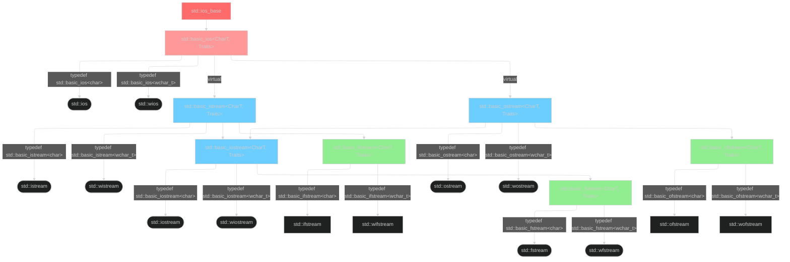

## C++ String Interface 
#### Note based on cppreference 
In cppreference description provided for `std::basic_string`. In fact, it's template which depends on template argument create "different" string:

| Type                          | Definition                         |
| ----------------------------- | ---------------------------------- |
| `std::string`                 | `std::basic_string<char>`          |
| `std::wstring`                | `std::basic_string<wchar_t>`       |
| `std::u8string` (C++20)       | `std::basic_string<char8_t>`       |
| `std::u16string` (C++11)      | `std::basic_string<char16_t>`      |
| `std::u32string` (C++11)      | `std::basic_string<char32_t>`      |
| `std::pmr::string` (C++17)    | `std::pmr::basic_string<char>`     |
| `std::pmr::wstring` (C++17)   | `std::pmr::basic_string<wchar_t>`  |
| `std::pmr::u8string` (C++20)  | `std::pmr::basic_string<char8_t>`  |
| `std::pmr::u16string` (C++17) | `std::pmr::basic_string<char16_t>` |
| `std::pmr::u32string` (C++17) | `std::pmr::basic_string<char32_t>` |
|                               |                                    |
`::pmr` - polymorphic memory resource.

Beside that exists `std::basic_string_view` (with same tempalte-implementation idea) which contain some pretty identical member "r/o" functions (`find`, `contains`, `starts_with` etc)

In cppreference also used `ChartT`, `size_type` etc since examples taken from template functions and real type depends on string's template argument (`char`/`wchar_t`) etc.

### Searching Strings
* `{cpp} find(const basic_string& str, size_type pos = 0)`, `{cpp} find(const CharT* s, size_type pos = 0)`, `{cpp} find(CharT ch, size_type pos = 0)` (signature mean that we can use either string of single char for searching) return index of first match after `pos`. If character not found `std::string::npos` will be returned
* There is `rfind()` member function that finds the last occurrence of its argument (function signature same);
* `{cpp} find_first_of(const basic_string& str, size_type pos = 0)`, `{cpp} find_first_of(const CharT* s, size_type pos = 0)` - find first occurrence of any character from the argument string
* Similarly for `find_last_of` - find last occurrence 
* `find_first_not_of`/`find_last_not_of` search for the first (last) occurrence of any character not in the argument

#### from cppreference 
* `{cpp} find(const CharT* s, size_type pos, size_type count)` (and similar) - here looks like "search substring from s" (similarly to append), but in reality it's "find first `count` symbols from argument C-string `s` in original string starting from `pos`) 🤦
* `{cpp} find_first_of(CharT ch, size_type pos = 0)` equivalent to `{cpp} find(CharT ch, size_type pos = 0)`; same thing with `{cpp} find_last_of(CharT ch, size_type pos = npos)` == `{cpp} rfind(CharT ch, size_type pos = npos)`
* `{cpp} find_first_not_of(CharT ch, size_type pos = 0)` in general equivalent to `{cpp} find_last_not_of(CharT ch, size_type pos = npos)` since with only 1 character we can check that it's not exists in string. It's also can be used to check that string contain only one exact character (although `find_last_not_of` search from end to begin, to check that symbol not found we compare with `std::string::npos` and not 0, since 0 is index of first character)  
```c++
std::string str{"aaaaa"};
if (str.find_first_not_of('a') == std::string::npos)
    std::cout << "all of them a!\n";
if (str.find_last_not_of('a') == std::string::npos)
    std::cout << "all of them a!\n";
```


### Adding Elements to String
* `{cpp} append(const basic_string& str, size_type pos, size_type count)` - equivalent to `{cpp} append(str.substr(pos, count))`, add substring to current string
* `{cpp} insert(size_type index, const basic_string& str)`- insert string before `original_str[index]`
```c++
std::string str{"for"};
str.insert(2, "lde"s); // string is now "folder"
```
* `{cpp} insert(size_type index, const basic_string& str, size_type s_index, size_type count = npos)` - insert substring `str[s_index, count)` 
* `{cpp} insert(size_type index, size_type count, CharT ch)` - insert a char multiple times
* We can also use iterators, but remember that iterators can be invalid after modifying string (if allocation required after insert)
```c++
std::string str{"word"};
str.insert(std::prev(str.end()), 'l'); //str is now "world"

std::string str2{"ski"};
str2.insert(str2.end(), 2, 'l'); // str2 is now "skill"
```

### Removing Elements from Strings
* `{cpp} erase()` takes two arguments - index of the first element to be erased and number elements to erase. For position of first element we can `find` (just remember to check that character exist) 
```c++
std::string str{"Hello"};
if (auto pos = str.find('e'); pos != std::string::npos)
	str.erase(pos, 2); // string now "Hlo"
```
* We can also use iterators. If use single iterator - it will erase the corresponding element, with iterator range - it will erase all elements in the half-closed range (`[begin, end)`)
```c++
str.erase(std::next(str.begin()), std::prev(str.end())); // Erase all character except first and last
```
* `{cpp} replace()` will remove some of the characters from a string and replace them with other characters. The first argument is index of first character to be remove, the second argument is the number of character to be removed and the remaining argument give the characters that will be inserted 
```c++
std::string str{"Say Hello"};
str.replace(str.find('H'), 5 "Goodbye");
```
* Similarly to `{cpp} erase()` we can use iterators. 
```c++
str.replace(str.begin(), str.begin()+3, "Wave"); // str now "Wave Goodbye"
```
* `{cpp} assign()` can replace all the characters from a string with other characters

### Converting between Strings and Number
* `std::to_string` convert any numeric number to string.
* `{cpp} stoi (const std::string& str, std::size_t* pos = nullptr, int base = 10);` takes `std::string` argument and return it as an int. Leading whitespaces are ignored, but any non-number character terminate function.
```c++
std::string str{" 314 159"};
int val = std::stoi(str); // val = 314
```
* An optional second argument gives the number of character which were processed. If there is no errors, this is equal to the string's size, otherwise we get index of the first non-numeric character. _If the conversion fails completely, it throws an exception_
```c++
std::string str {" 123 "};
try {
    size_t n_processed;
    int val = std::stoi(str, &n_processed);
    if (n_processed < str.size())
        std::cout << "Processed only " << n_processed;
}
catch (std::invalid_argument e) {
    std::cout << "Not a number\n";
}
catch (std::out_of_range e){
    std::cout << "Can't fit into type";
}
```
* By default string is assumed to be decimal by default. An optional third argument gives the base (can be 2-36, 0 - the numeric base is auto-detected)
```c++
std::cout << std::stoi("2a", nullptr, 16); // will display 42
```
* For `double` can be used `{cpp} std::stod()`, it's pretty same but don't have option to use different bases

#### cppreference 
Beside `std::stoi` and `std::stod` also exists 

| Returned type        | Function        |
| -------------------- | --------------- |
| `long`               | `std::stol()`   |
| `long long`          | `std::stoll()`  |
| `unsigned long`      | `std::stoul()`  |
| `unsigned long long` | `std::stoull()` |
| `float`              | `std::stof()`   |
| `long double`        | `std::stold()`  |
Strange that conversion to `unsigned int` not exists, one of theory is that it's due to size equality with `unsigned long` in most platforms (plus in some implementations range changed against `unsigned`)

### Miscellaneous String Operations
* `std::string` and `std::vector` have a `{cpp} data()` member function, which return a pointer to the container's internal c-style memory buffer. For `std::string` this is null-terminated and equal to `{cpp} c_str()`. It's useful for working with APIs written in C 
```c++
void print (int* array, size_t size);

std::vector<int> number {1, 2, 3, 4};
print(numbers.data(), numbers.size());
```
* `std::string` has `{cpp} swap()`, which also implemented to support global `{cpp} swap(T left, T right)` function.

### Character Functions
* C++ STL has a number of character functions which are inherited from C, these are defined in `<cctype>` and operate on `char`. 
	* `{cpp} std::isdigit(c)` - returns `true` if `c` is a digit
	* `{cpp} std::islower(c)` - returns `true` if `c` in lower case
	* `{cpp} std::isupper(c)` - return `true` if `c` is upper case
	* `{cpp} std::isspace(c)` - return `true` if `c` is a whitespace character
	* `{cpp} std::ispunct(c)` - return `true` if `c` is a punctuation character
* `{cpp} std::tolower()` and `{cpp} std::toupper()` to convert to character case equivalent.

#### from cppreference
All of them take as argument `int` since function checks character ASCII code. Also in standard exist
* `std::isalnum()` - checks if a character is alphanumeric (numbers, lower and upper case letters)
* `std::isalpha()` - checks if a character is alphabetic (lower and upper case letters)
* `std::isxdigit()` - checks if a character is a hexadecimal character
* `std::iscntrl()` - checks if a character is a control character
* `std::isgraph()` - checks if a character is a graphical character (digits, letters, punctuation)
* `std::isblank()` - checks if a character is a blank character (`0x20` and `0x09`)
* `std::isprint()` - checks if a character is a printing character (isgraph + space)

## Files and Streams
#### Note based on cppreference
Similarly to strings, streams in cppreference described as templates `basic_{something}stream` since stream template can be specialized with template parameter of type `char` and `wchar_t`: `{cpp} std::ifstream == std::basic_ifstream<char>`, `{cpp} std::wifsteam == std::basic_ifstream<wchar_t>`


### Files and Streams 
Files interaction are represented by `fstream` objects, accessed as sequence of bytes in order of unknown length with no structure (without any understanding of file format). 
`fsteram` operations includes 
* `open` - connect the `fstream` object to the file, the file becomes available for used by the program (locked?)
* `read` - data is copied from the file into the program's memory
* `write` - data is copied from the program's memory to the file
* `close` - disconnect the `fstream` object from the file, the file is no longer available for use by the program. 
For each if these operations, the `fstream` object will call a function in the operating system API. The program will stop and wait while the operation is performed. OS can also restrict amount of opened files by the program, this is also one of reasons why the file should be closed after use.
During reading/writing data to file data may be stored in temporary memory buffer. It's done to reduce downtime during interacting with physical device. 

### File Streams
In C++ commonly used two types of `std::fstream`: 
* `std::ofstream` - file stream for writing
* `std::ifstream` - file stream for reading
As there are many different files on a computer, we need to associate a file stream object with the file we are using. The easiest way to open a file is to pass its name to the `std::ifstream` constructor. This represents a "communication channel" which is used to receive data from the file. Constructor can failed to open file, thus before accessing file it worth it to check is file opened or not.  
```c++
#include <fstream>
std::ifstream ifile("text.txt");
if (ifile)
	std::cout << "File opened\n";'
```
>The way how `{cpp} if (ifile)` work is due to implementation of [`operator bool()`](https://en.cppreference.com/w/cpp/io/basic_ios/operator_bool) in base class `std::basic_ios`

We can use `ifile` the same way as `std::cin`. This will read one word at a time and remove all whitespace from the input. But it's not ideal way to work with file stream since it's maybe be not suitable for data structures and can be difficult for error-handling
```c++
std::string text;
while (ifile >> text)
	std::cout << text << ", ";
```
Often it's easier to read a complete line of input from the file with `{cpp} getline()` functions. It can be either `{cpp} std::getline(input_stream, string)` or stream member function, function also support optional argument for delimiters. Into input string will be copied whole line except newline character. When end of file will be reached, `{cpp} getline()` will return `false`, meaning that function can be used inside loops
```c++
while (std::getline(ifilem, text))
	std::cout << text << '\n';
```

For writing we create a stream object `std::ofstream`, can write same way as `std::cout`. In fact there no opposite to `getline`.

When `std::fstream`'s destructor is called, the file is automatically closed, any unsaved data will be written to the file. If and `std::fstream` object goes out of scope after we have finished with it, we don't need to explicitly call `{cpp} close()`, however it's good practice to do so.

### Streams and Buffering 
C++ streams use "buffering" to minimize calls to the operating system. During write operations, data is temporary held in a memory buffer, the size of this buffer is chosen to match the maximum amount of data that the operating system will accept. When the buffer is full, the steam will remove the data from the buffer and send it to the operating system. This is known as "flushing" the output buffer. 
For `std::ostream` flush depends on the terminal configuration. Usually this is at the end of every line, `std::cout` is always flushed before the program reads from `std::cin`. `ofstream` is only flushed when the buffer is full. There is no direct way to flush input streams. 

A steam manipulator `std::flush` allows to control when the steam's buffer is flushed. All the data in the buffer is immediately sent to its destination. This cost some performances, thus should only be used if the data really needs to be up date (e.g. log file to find out why a program crashed). 

## Unbuffered Input and Output
The are some applications where stream buffering is not suitable (e.g. a network application, where data must be transmitted in "packet" of a specific size at specific times). 
C++ supports lower level operation on streams to bypass stream's buffer. 
As an example streams member functions `{cpp} get(char_type& ch)` and `{cpp} put(char_type ch)` to operate with single character. 
For reading and writing many characters, there are `{cpp} read(char_type* s, std::streamsize count)` and `{cpp} write(const char_type* s, std::streamsize count)`, for which we have to provide our own buffer (for `read()` the buffer must be large enough to store all the data we expect to receive). 
Member function `{cpp} gcount()` return the number of characters that were actually received (it can be used to allocate memory, detect partial or incomplete transfers etc)
```c++
const auto filesize{10U};
char filebuf[filesize];
std::ifstream ifile{"input.txt"};
if (!ifile)
	return -1;

ifile.read(filebuf, filesize);
auto nread = ifile.gcount();
ifile.close();
std::cout << "Read " << nread << " bytes\n";
std::cout.write(filebuf, nread); 
```

#### cppreference note
Mentioned above member functions are part of `std::basic_ostream` and `std::basic_istream` template classes. 
Beside them also exists:
* From `{cpp} std::basic_istream<CharT,Traits>`:
	* `{cpp} int_type get();` - reads one character and returns it if available, otherwise returns `Traits::eof()`
	* `{cpp} basic_istream& get(char_type* s, std::streamsize count, char_type delim = widen('\n'))` - reads characters and stores them into the `s` until in stream not found `delim` or not reached `count` limit, also adds null-character. Almost similar to `read`, but `read` ignores delimiter.
	* `{cpp} basic_istream& get(basic_streambuf& strbuf, char_type delim = widen('\n'));` - reads characters and inserts them to the output sequence controlled by the given `basic_streambuf` object. 
	* `{cpp} int_type peek()` - reads the next character from the input stream without extracting it
	* `{cpp} basic_istream& unget()` - return back to stream last read character, making it available again.
	* `{cpp} basic_istream& putback(char_type ch)` - put back character `ch` and make it available for next reading. Similar to `unget`, but `unget` don't have an argument. 
	* `{cpp} basic_istream& ignore(std::streamsize count = 1, int_type delim = Traits::eof());` - extracts and discards characters from the input stream until and including `delim`.
	* `{cpp} std::streamsize readsome(char_type* s, std::streamsize count);` - read immediately available characters from the input stream and return amount of read characters. Compared to `read()` it's asynchronous non-blokcking call.

### File modes 
C++ gives us a number of options for opening a file called "modes".

By default, files are opened in `std::ios_base::in` in "text mode" and output files are opened in `std::ios_base::out` actually opened in `std::ios_base::trunc` "truncate mode" - any previous data will be overwritten starting from the begging of the file.

`std::ios_base::app` will open file in append mode - seek to the end before each write (meaning that `seekp()` have no effect) 
`std::ios_base::binary` - binary mode - the data store in the file will be identical to the data in memory 
`std::ios_base::ate` - will open {a}t {t}he {e}nd, but allows also use of `seekp()`

Modes are actually bit-masks which we can combine for different modes with logical operator "or": `{cpp} file.open("text.txt", std::ios::out | std::ios::app)`

Restrictions: 
* `std::ios::out` only for `fstream` and `ofstream`
* `std::ios::in` only for `fstream` and `ifstream`
* `std::ios::trunc` only in output mode 
* `std::ios::app` can't combine with `std::ios::trunc`, the file will always be opened in output mode. 
> Note: compiler doesn't provide any error or warnings on restrictions violation and it's classified mostly as undefined behavior

#### cppreference note
Above I used `std::ios_base::in`, `std::ios:in`, also possible to use `std::fstream::in`, `std::ifstream::in`, even `std::ofstream::in`. This due to how inheritance works: 



In general it's possible to use for any purpose `std::fstream`, but it's not follows [Principle of least privilege](https://en.wikipedia.org/wiki/Principle_of_least_privilege) (use only what is need), can cause performance redundancy (output buffer synchronization when we use file only for reading etc) and actual make some restrictions (in general OS allow multiple descriptors for reading, but since for writing, `std::fstream` will use both write and read, meaning that where we only read files - we not allow writing in it from other place). 

### Stream Member Functions and State
* `{cpp} void open(const char* filename, std::ios_base::openmode mode = std::ios_base::out)` - allows to bind file to stream object after it's initialization, for output if file does not already exist, it will be created (similar statement applies to `std::ofstream` constructor as well). `filename` also can be type of `const std::string&` (since C++11) or `const std::filesystem::path::value_type*`/`const std::filesystem::path&` since C++17
* `{cpp} bool is_open() const` - check if the file is opened.
* `{cpp} bool good() const` - returns `true` if the input was read successfully.
* `{cpp} bool fail() const` - returns `true` if there was a recoverable error (e.g. reading in wrong format).
* `{cpp} bool bad() const` - return `true` if there was an unrecoverable error. 
* `{cpp} bool clear() const` - restore the stream's state to valid.
* `{cpp} bool eof() const` - returns true after the end of file has been reached.

One moment about `eof()` 
```c++
std::ifstream ifile{"input.txt"};
int x{};

/* 
Incorrect use of eof if file 
	``
	1
	2
	
	``
- ouput result will be `1, 2, 2` since new line is considered not as end of file, stream will ignore emptyline and not modify x
*/
while (!ifile.eof()) {
	ifile >> x;
	std::cout << x <<", ";
}

/*
"correct way" (unless input not)
	 ``
	 1
	 2
	 abc
	 3
	 ``
- result will be `1, 2` since operator>> will terminate on first non-number character. 
*/ 
while (ifile >> x)
	std::cout << x <<", ";

/* and this where good()/fail() can help to identify incorrect imput*/
```
In next example one of implementation for "correct" input handling. Problem when we input not a number - `oprator>>` terminate execution with setting fail flag, incorrect input stay in buffer (which can cause endless loop). Directly we can't flush input buffer - we can only ignore symbols in it. But we don't known how many symbols to ignore - only way is to ignore maximum possible amount of symbols. But it's also not ideal, input "123a" will output "123"
```c++
int x{};
std::cout << "Input a number: ";
std::cin >> x;

bool success{false};
while (!success) {
    if (std::cin.good()) {
        std::cout << "You entered: " << x << '\n';
        success = true;
    } 
    else if (std::cin.fail()) {
        std::cout << "Invalid input. Please enter a valid number: ";
        std::cin.clear();
        std::cin.ignore(std::numeric_limits<std::streamsize>::max(), '\n');
    }
}
```
(shorter version)
```c++
int x{};
std::cout << "Input a number: ";

while (!(std::cin >> x)) {
    std::cout << "Invalid input. Please enter a valid number: ";
    std::cin.clear();
    std::cin.ignore(std::numeric_limits<std::streamsize>::max(), '\n');
}
```


### Stream Manipulators and Formatting
Manipulator is "something" that gets pushed onto a stream to affect stream's behavior. Some manipulators already presented in `<iostream>` (like `std::endl`, `std::flush`), but there also manipulators from `<iomanip>`
> Actually, manipulators are in headers `<ios>`, `<istream>`, `<ostream>` and `<iomanip>`.

* `std::boolalpha` - print out bool values as "true" and "false", `std::noboolalpha` to disable
* `{cpp} std::setw(int n)` will pad the next data item on the stream field to make it the width of its argument. By default it right-justified, for switching to left-justified - used `std::left`. 
* `std::left` - _sticky_ manipulator, it will affect whole stream until opposite _sticky_ manipulator not pushed.
* `{cpp} std::setfill(CharT c)` - sets the padding character. Also _sticky_ (and reset with `{cpp} std::setfill(' ')`)
```c++
std::cout << std::setfill('.') << std::left 
          << std::setw(15) << "Penguins" << 5 <<'\n'
          <<  "Hippopo" << "tamuses" << '\n'
          << std::setfill(' ') << std::right 
          << std::setw(15) << "Bear" << 2 <<'\n';
          
/*
Penguins.......5
Hippopotamuses
           Bear2
*/
```

### Floating-point Output Formats
C++ by default for relatively small float-point number will output output with 6 significant figures (`{cpp} std::cout << 3.141'592'653` will display "3.14159"). For large `double` numbers will be provided  scientific notation ("1.00000e-006" represent 1.0000 * 10^-6).

Scientific notation can be force for whole stream with `std::scientific` manipulator. Also with `std::uppercase` 'e' can be forced to 'E' (disabled with `std::nouppercase`). 

The fixed manipulator `std::fixed` will cause floating-point number to be displayed as fixed-point. The number will be displayed to 6 decimal places, truncating or padding with 0 if necessary. Also worth note that `{cpp} double e{1.602e-19}` with `{cpp} std::cout << std::fixed << e;` will display "0.000000" since value to small and it's got truncated. 

All mentioned manipulators are _sticky_, meaning that after applying them - unexpectedly stream will remain this changes. Thus it's better to set `std::defaultfloat` after stream being used. 

Manipulator `{cpp} std::setprecision(int n)` set the precision of the stream(the number of digits that are displayed). 
 
### More from cppreference
Most of manipulators appliable for both input and output streams. 

* `std::dec`, `std::hex`, `std::oct` - set base field for whole stream 
> Note: there no manipulator for binary format, but if it's required - can be used `std::bitset` trick: `{cpp} std::cout << std::bitset<8>{42}`
* `std::showbase/std::noshowbase` - enable/disable show base for whole stream. Even though it's applies to everything in stream, it have effect only for integer values and when `std::hex` or `std::oct` applied to stream as well.
* `std::showpoint`/`std::noshowpoint` - enable decimal point character for floating-point values. By default it's disable and `{cpp} std::cout << 3.0` will show just '3', while with `std::showpoint` output will be `3.00000`. Can be combined with `std::setprecision`, but with precision = 2 to achieve output only "3.0" - all other floats will be also affected. 
* `std::showpos`/`std::noshowpos` - shows '+' sign for numeric values (both float and integer)
* `std::skipws`/`std::noskipws` - Enables or disables skipping of leading whitespace by the formatted input functions (enabled by default)
```c++
std::istringstream("a b c") >> c1 >> c2 >> c3;
// c1 = a, c2 = b, c3 = c
std::istringstream("a b c") >> std::noskipws >> c1 >> c2 >> c3;
// c2 = s, c3 = ' ', c3 = b
```
* `std::uppercase`/`std::nouppercase` - enables the use of uppercase characters in floating-point and hexadecimal integer output
* `std::unitbuf`/`std::nounitbuf` - enables or disables automatic flushing of the output stream after any output operation. By default stream flushed when buffer overflow, `std::flush` or `std::endl` pushed, when exiting application. `std::cerr` and `std::wcerr` have `std::unitbuf` enabled. 
* `std::internal` - Sets the adjust field of the stream to internal. Addition to `std::left` and `std::right`.
* `std::hexfloat` - in addition to `std::fixed`, `std::scientific` - change representation of float values. `std::defaultfloat` doesn't affect other float manipulators (like `std::setprecision`)
* `std::ws` - Discards leading whitespace from an input stream. Input-only manipulator. 
* `std::ends` - insert null-symbol. Unlike `std::endl`, does not flush the stream. Typically used with `std::ostrstream`
* `std::emit_on_flush`/`std::noemit_on_flush` - C++20 manipulator for `std::basic_syncbuf`, toggles whether it emits (i.e., transmits data to the underlying stream buffer) when flushed, output-stream only. In reality used not so often, in theory with multiple threads which writes into one stream and required output atomicity, but in most cases it's can be achieved with `std::mutex`/`std::lock_guard`.
* `std::flush_emit` - another C++20 manipulator for `std::basic_syncbuf`, add `buf.emit()` with `os.flush()`, output-only.
* `{cpp} std::setbase(int base)` - sets the numeric base of the stream, only work with base == 8, 10, 16. 
* `{cpp} std::get_money(MoneyT& mon, bool intl = false)`/`{cpp} std::put_money(const MoneyT& mon, bool intl = false)`- operate with money format input/output (like "$1,234.5", "2.22 USD", "3.33") and save into integer variable where 2 last symbols - 
* [`std::get_time`](https://en.cppreference.com/w/cpp/io/manip/get_time.html)/[`std::put_time`](https://en.cppreference.com/w/cpp/io/manip/put_time.html) - operate with time format. Quite powerful and flexible thing which support different formats, locals etc, like 
```c++
std::cout.imbue(std::locale("ru_RU.utf8"));
std::cout << "ru_RU: " << std::put_time(&tm, "%c %Z") << '\n';
//ru_RU: Ср. 28 дек. 2011 10:21:16 EST
```
* `{cpp} std::quoted(s, CharT delim = CharT('"'), CharT escape = CharT('\\')` - allows insertion and extraction of quoted strings. `s` can be type of `{cpp} const CharT*`, `{cpp} const std::basic_string<CharT, Traits, Allocator>&`, `{cpp} std::basic_string_view<CharT, Traits>`, `{cpp} std::basic_string<CharT, Traits, Allocator>&` (in another words - accept any string). `delim` can be any character, so 
* `{cpp} std::setiosflags(std::ios_base::fmtflags mask);`/`{cpp} std::resetiosflags( std::ios_base::fmtflags mask);` - set or unset specific format flag mask. `{cpp} std::resetiosflags(std::ios_base::basefield)` 

### String Streams
String streams are defined in `<sstream>`. In effect, it's a wrapper around `std::string` that makes it looks like a stream object, string streams has `std::string` data member and same member functions as the other stream classes. In general, it's example of "adapter" design pattern. 

`std::ostringstream` has an empty `std::string` object. We can store data in this string, using the same operations as for other output stream. `str()` member function will return a copy of the stream's string. 
```c++
template<typename T>
std::string ToString(const T& t) {
	std::ostringstring oss;
	oss << t;
	return oss.str();
}
```
Another example is "builder pattern" - a technic to make formatted string (for example, from input string);
```c++
std::ostringstream ostr;
std::string input;

std::cout << "Enter a product name: ";
std::cin >> input;
ostr << std::left << std::setw(8) << input;
std::cout << "Enter amount: ";
std::cin >> input;
ostr << std::setw(4) << input;

std::cout <<  ostr.str() << std::endl;
```
`std::ostringsteams` are useful when interfacing to systems that expect strings in particular formats (GUI, operating systems, third party library).

`std::istringstream` object uses a copy of an existing string and it can be used to read the data from string, using the same operations as for other input stream. Basic flow during working with `std::istringstream` is 
* Read the input into an `std::string` -> validate the input data (check for incomplete, correct format, handle errors) -> bind `std::string` to `std::istringstream` object -> read the data from the `std::istringsteam`. 
```c++
std::string input;
while (std::getline(std::cin, input)) {
	// validation, error handling, etc
	std::istringstream istr{text};
	int num;
	
	while (istr >> num) {
		std::cout << num << '\n'; 
	}
}
```
`std::istringstream` can be used to process input more easily and safely. 

### Resource Management 
As programmers, we often use resources (heap memory, files, DB connections, GUI windows etc.). And these need to be managed: 
* We have to allocate, open or acquire the resource before use
* We have to release or close the resource after use 
* We may need to give special though to copying the resource 
* We need to think about error handling. 
STL has some classes which manager resources:
- Allocated memory (`std::string` and `std::vector`)
- Files (`std::fsteam`)
- Objects used in multi-threading.
- etc
These follow the object-orientated principle of encapsulation: the details of managing the resource are hidden inside the class. Other code does not need to deal with resource directly and manipulation done via interfaces.  

As example, `std::fstream` "encapsulates" the details of how to manage a file. We don't need to know anything about how to works with files directly and use provided interface - give the name of file to the `std::fstream` constructor or `{cpp} open()` member function, use `operator<<`, `operator>>`, `{cpp} put()`, `{cpp} get()` etc. 

C++ classes which manage a resource follow a common idiom:
* The resource is stored as a private member of the class
* The class constructor acquires the resource 
* The class's public member function control access to the resource 
* The class's destructor releases the resource.
When an object is copied or assign to, the target object acquires its own version of the resource. 
This idiom is known as RAII = Resource Acquisition Is Initialization. 

RAII provide several advantages. Obtaining access to resource is straightforward and deterministic - the object is successfully created if the resource available for program, otherwise object invalid or/and can provide additional failure information. Using the resource is straightforward - just call the object's member functions. Releasing the resource is straightforward - the resource is released when the object is destroyed. And only one object can own a given resource at a time. 

### Random Access to Streams 
Usually we access stream sequentially (starting from beginning and moving step by step). C++ streams also have a position marker. This keeps track of where the next read or write operation will be performed. Normally, the stream controls the marker's position, however in some cases (mostly for `std::stringstream` and `std::fstream` not in `std::ios::app` mode) the programmer can alter its position. This allows to read or write data anywhere in the stream (if possible).  

C++ provides "_seek_" member function for p(ut) and g(et) operation on stream:
* `{cpp} basic_istream& seekg(pos_type pos)` - sets the current position in an input stream
* `{cpp} basic_ostream& seekp(pos_type pos)` - sets the current position in an output stream
There are also "_tell_" member functions which return stream current position: 
* `{cpp} pos_type tellg()` - return the current position in an input stream
* `{cpp} pos_type tellp()` - return the current position in an output stream

_Seek_ and _tell_ operations are only defined for the appropriate streams (`basic_ostream`/`basic_istream`). The are defined for basic streams, but cannot do anything useful for `std::iostreams` and mostly will cause a runtime error and will put stream into an invalid state. 

`tellp()/tellg()` return `pos_type` object which can be converted to int. If operation failed (if stream is in an invalid state), returned position will be equal to -1.

_Seek_ operation can take one `pos_type` argument, which will move the market to an absolute position, or take 2 argument, `{cpp} basic_ostream& seekp/seekg(off_type off, std::ios_base::seekdir dir)` to set position (positive or negative) relative to `dir` base position, `dir` can be `std::ios_base::beg`, `std::ios_base::cur`, `std::ios_base::end`

```c++
std::ostringstream oss;
oss << "It is time to say ";

auto bookmark {oss.tellp()};

oss << "goodnight";
std::cout << oss.str() << '\n'; // It is time to say goodnight

if (bookmark != -1)
    oss.seekp(bookmark);
oss << "hello";
std::cout << oss.str() << '\n'; // It is time to say helloight
```

Usually best way to modify a file is to read it into a `std::istringstream`, get the bound `std::string` and make the changes to the data and when ready - overwrite the original file. _Seek_ and _tell_ operations can be used to modify a file in-place. It's more complicated and not should be used with care (considering data overwriting, error handling if original file is no longer available). 


### Stream Iterators 
The STL provides iterators which works on streams in header `<iterator>`, `std::istream_iterator` and `std::ostream_iterator`. They can work only if all data have the same type, which used in instantiation of iterators. 

Stream iterators have a very limited interface:
* Assigning to an `std::ostream_iterator` will put an object on the stream
* Dereferencing an `std::istream_iterator` will get the object at the current position in the stream 
* Incrementing and `std::istream_iterator` will move iterator to the next object. 
* `std::ostream_iterator` can be dereferenced and incremented, but it does nothing and added for interface consistency. 

An `std::ostream_iterator` must be bound to an output stream, every time we assign to this iterator, data is pushed onto the stream (iterator will call `operator<<` technically.) As second optional constructor argument can be provided delimiter as c-style string (`{cpp} const CharT* delim`)
```c++
std::ostream_iterator<int> oi(std::cout, ";\n");
for (int i = 0; i < 10; i++) {
	*oi = i;
	oi++; // Does nothing, just to align with iterator logic.
}
```

An `std::istream_iterator` works pretty similarly - we bound to an input stream, provide data type, but it doesn't have delimiter optional parameter. Also we can construct `{c++} std::istream_iterator<string> iEnd{};` which can be used as end-of-stream iterator.
```c++
std::istream_iterator<std::string> iis(std::cin);
std::istream_iterator<std::string> iEnd{};

std::vector<std::string> vs;
while (iis != iEnd) {
	vs.push_back(*iis++);
}
```

### Binary Files
Binary files opened with `std::ios::binary` flag. The `operator>>` and `operator<<` are note suitable since they perform conversion between data and text format, throw away whitespaces etc. Instead used `{cpp} write()` and `{cpp} read()` functions. 

The data in a binary file needs to be structed in some way to make it meaningful to the application that use it. The best way to work with a binary file is to create `struct` whose data members correspond to the fields in the file format. 
The first argument to `{cpp} read()` and `{cpp} write()` will be the pointer `char *` to object, which can be get using `{cpp} std::reinterpret_cast<char*>(&p)`. The second argument is the number of bytes of that object `{cpp} sizeof(p_struct)`

Modern hardware is optimized for accessing data which is "word aligned". On a 32-bit system this means that the address of each object is a multiple of 4, on x64 - with multiple of 8.

| Offset   | 0x00 | 0x01-0x03 | 0x04-0x07 | 0x08-0x0B | 0x0C-0x0F |
| -------- | ---- | --------- | --------- | --------- | --------- |
| **Data** | bool | padding   | float     | float     | padding   |
| **Size** | 1    | 3         | 4         | 4         | 4         |
If data not aligned - accessing the data will be much slower (sometimes even not possible). If a struct is not word-aligned, compilers will usually add extra bytes ("padding" bytes). However it's not recommended to add padding manually this padding is depends on platform and code become not portable. 

If we actually want the data to be at different offsets, these padding bytes will introduce a discrepancy (program can treat such bitmap as invalid). Most compilers provide a non-standard `#pramga pack(push, n-bytes)` directive to set the alignment.

C++11 has also `alignas(n)` keyword that force the compiler to align an element at a given offset. However, it's ignored if the argument is less than the word size, because some architecture don't support unaligned access 
```c++
// Every object of type sse_t will be aligned to 32-byte boundary:
struct alignas(32) sse_t
{
    float sse_data[4];
};
```