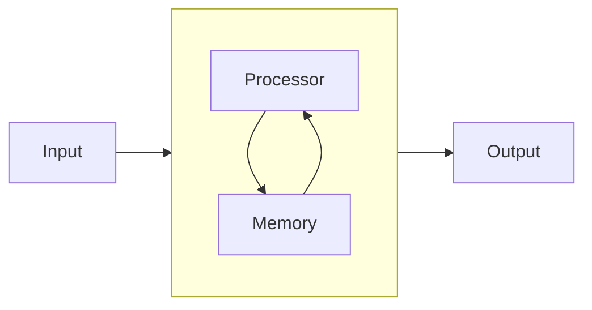
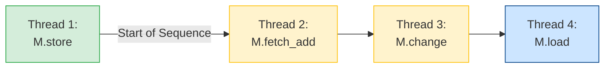

## Atomic
Atomic operation is an indivisible operation that cannot be observed half-done from any thread in the system. 

Some C++ operations are non-atomic and can be executed in several machine instructions. For example, `i++` typically involves three steps: read the value of `i`; increment that value by one; store the modified value. In multi-threaded code, this leads to a race condition where two threads might read the same initial value and the final result is an increment by 1 instead of 2.

Atomic objects are free of data races, which allows the creation of lock-free data structures and algorithms. Atomicity may be achieved either via _lock-free CPU instructions_ (hardware-based) or via internal locks (software-based, e.g., a mutex) provided by the C++ library implementation on the given platform. The C++ standard allows for atomic types to be _sometimes_ lock-free. The following functions and constants check the lock-free status:
- `{cpp}bool std::atomic_is_lock_free(const std::atomic<T>*)` - non-member function which determines if the atomic object is implemented lock-free.
- `{cpp}bool is_lock_free() const noexcept` - member function of `std::atomic` class.
- `{cpp}static constexpr bool is_always_lock_free` _(C++17)_ - static member constant equals `true` if this specialization of `std::atomic` is guaranteed to be lock-free on all target platforms, and `false` otherwise.

STL provides both the template class, e.g., `{cpp}std::atomic<int>`, and typedef versions for most built-in types, e.g., `{cpp}std::atomic_int`.

`std::atomic` does not have copy or move assignment/construction. Atomics can be stored in containers using `{cpp}emplace()` for in-place construction, and their values can be copied using explicit atomic operations, e.g., `{cpp}a1.store(a2.load())`, or copied (loaded) into a non-atomic variable. References and pointers to atomic objects can be used.

### Atomic flag
`std::atomic_flag` is the most basic atomic type, representing a simple boolean flag. It is typically initialized with `{cpp}ATOMIC_FLAG_INIT` for _static storage duration objects_, and is guaranteed to be initialized to clear (`false`). `std::atomic_flag` is _guarantee lock-free_ implementation. Compared to `std::atomic_bool`, it has a limited interface, lacking simple `{cpp}load()` and `{cpp}store()`.

`std::atomic_flag` provide following interface: 
+ `{cpp}void clear(std::memory_order order = std::memory_order_seq_cst)` - set value to `false` 
+ `{cpp}bool test_and_set(std::memory_order order = std::memory_order_seq_cst)` which set value to `true` and return previous state. 
+ (_from C++20_)
	+ `{cpp}bool test(std::memory_order order = std::memory_order_seq_cst)` - return current value 
	+ `{cpp}void wait(bool old, std::memory_order order = std::memory_order_seq_cst)` - compare current value with `old` and block execution until current value not changed to different from `old`. Thread can be unblocked via notification functions or via spurious wake-up, yet execution will continue when value changed (similarly to conditional variable with `{cpp}cv.wait(lock, []{ return condition; });)
	+ `{cpp}void notify_one()`/`{cpp}void notify_all()` - performs atomic notifying operations


### Atomic objects
`std::atomic<T>` objects initialization _is not atomic_. For initialization used non-atomic value. 
_Prior to C++20_, the default constructor left the object uninitialized (except for static/thread-local objects, which were zero-initialized); non-static objects needed non-atomic initialization via `{cpp}std::atomic_init`. 
_Since C++20_, the default constructor performs value-initialization (`T()`), and `{cpp}std::atomic_init` has been deprecated.

`{cpp} std::atomic<T>` class provide next interface for interacting with atomic objects:
+ `{cpp}void store(T desired, std::memory_order order = std::memory_order_seq_cst)` - atomically replace the current value with desired. 
+ `{cpp}T load(std::memory_order order = std::memory_order_seq_cst)` - atomically loads and return the current value
+ `{cpp}operator T()` - conversion operator, equivalent to `{cpp}load()`. 
+ `{cpp}T exchange(T desired, std::memory_order order = std::memory_order_seq_cst)` - atomically replace the underlying value with desired and return atomic variable before the call. 
+ `{cpp}bool compare_exchange_weak(T& expected, T desired, std::memory_order success, std::memory_order failure)`
	`{cpp}bool compare_exchange_weak(T& expected, T desired, std::memory_order order = std::memory_order_seq_cst)`
	`{cpp}bool compare_exchange_strong(T& expected, T desired, std::memory_order success, std::memory_order failure)`
	`{cpp}bool compare_exchange_strong(T& expected, T desired, std::memory_order order = std::memory_order_seq_cst)` - atomically compares values with `expected`, if those are bitwise-equal, replaces the former with `desired`, otherwise, loads the actual stored value into `expected`. Return `true` if store is performed. `_weak` is susceptible to spurious failures (returning `false` even if the comparison succeeded), often due to loop-based CPU instructions that might be interrupted. It's typically used in a loop. `_strong` on the other hand might use extra instructions to guarantee compare exchange, which affect performance. 

For `std::atomic<T*>` atomic is a pointer - doesn't mean that objects pointed to is atomic, but pointer it self is atomic. 

For integral, floating point (since _C++20_) and atomic pointers (for atomic pointers used `std::ptrdiff_t arg` function argument) there are additional member functions: 
+ `{cpp}T fetch_add(T arg, std::memory_order order = std::memory_order_seq_cst);` - replaces the current value with the result of arithmetic addition of the value and `arg`.  Return previous value. 
+ `{cpp}T fetch_sub(T arg, std::memory_order order = std::memory_order_seq_cst);` - replaces the current value with the result of arithmetic subtraction of the value and `arg`.  Return previous value. 
+ `{cpp}T operator+=(T arg)`/`{cpp}T operator-=(T arg)` - equivalent to `{cpp}return fetch_add(arg) + arg`

For integral and pointers also available atomic pre-increment, post-increment, pre-decrement and post-decrement. (Unlike most pre-increment and pre-decrement operators, the pre-increment and pre-decrement operators for atomic types do not return a reference to the modified object. They return a copy of the stored value instead). From _C++26_ also expected `{cpp}T fetch_max(T arg, std::memory_order order = std::memory_order_seq_cst)` and `{cpp}T fetch_min(T arg, std::memory_order order = std::memory_order_seq_cst)` - atomically replaces the current value with the result of `std::max`/`std::minn` of the value and `arg`.

For integral only - `{cpp}T fetch_and(T arg, std::memory_order order = std::memory_order_seq_cst)`/`{cpp}T fetch_or(T arg, std::memory_order order = std::memory_order_seq_cst)`/`{cpp}T fetch_xor(T arg, std::memory_order order = std::memory_order_seq_cst)` - atomic boolean operations. And `{cpp}T operator&=(T arg)`/`{cpp}T operator|=(T arg)`/`{cpp}T operator^=(T arg)` - equivalent of `{cpp}return fetch_and(arg) & arg`/`{cpp}return fetch_or(arg) | arg`/`{cpp}return fetch_xor(arg) ^ arg` respectfully. 

For user-defined types (`T` in `std::atomic<T>`) to be used, they must satisfy strict requirements, primarily:
1. `T` must be _Trivially Copyable_.
2. `T` must be _bitwise equality comparable_. (This often implies that `T` is also a Standard Layout Type for compatibility and proper memory alignment, although the C++ standard focuses on Trivially Copyable and Trivial Copy-Assignment).


## Memory ordering 
With `std::atomic` we can describe _ordering constraints_ on memory operations between different threads between multiple threads: 
+ _Happen-before_ - All expressions in a single thread evaluate in the order specified by the program's source code. If statement A appears before statement B in the source code of a thread, A generally happens-before B in that thread. 
+ _Synchronized with_ - is the direct, cross-thread synchronization link. This is the trigger for cross-thread ordering.
+ _Inter-thread-happen-before_ - is the transitive closure of the other two relations. An action A happen before 

```cpp
// Synchronized with: data_ready - is synchronization link. 
std::atomic<bool> data_ready {false};
std::vector<int> data_vector;

void t1() {
	using namespace std::literals;
	while (!data_ready)
		std::this_thread::sleep_for(500ms);
		
	// Inter-thread-happen-before: Before reading - synchronization via data_ready should be achieved
	std::cout << data_vector.at(0) << '\n';	
}

void t2(int data) {
	data_vactor.emplace_back(data);
	// Happen-before: Flag update only when data insearted into shared vector
	data_ready.store(true);             
}
```

Modern CPU  architecture significantly evolved from simple von Neumann machine.

CPU contains  L1\L2\L3 fast caches, store buffers etc, mostly because writing value to the memory takes longer than reading since writing is a blocking operation. This introduce scenarios, when during working on the different variables, even though the write to a variable happened before reading another variable in the source code, write may execute after read due to *instructions reordering* in store buffers.   

C++ standard specify following memory ordering options: 
+ `memory_order_seq_cst`
+ `memory_order_relaxed`
+ `memory_order_acquire`
+ `memory_order_consume`
+ `memory_order_release`
+ `memory_order_acq_rel`

Atomic operation can be divided on 3 categories. And based on categories - what memory order can be used:
1. Loads (Reading) operations: we can use `memory_order_acquireacquire` semantics here (along with `memory_order_relaxed`, `memory_order_consume`, and `memory_order_seq_cst`).
2. Stores (Writing): we can use `memory_order_release` semantics here (along with `memory_order_relaxed` and `memory_order_seq_cst`).
3. Read-Modify-Write: Since these perform both a read and a write, they support all memory orders, including combined `memory_order_rel_acq`.

`memory_order_seq_cst`(sequel consistent) - implies that the behavior of the program is consistent with a simple sequential view of the world. This is most strict order options and used as default value for every atomic operation, since it's provided almost same order as in source code. 
`memory_order_relaxed` total opposite to sequel consistent - implies that view of the threads doesn't need to consistent to each other. No restriction of instruction re-ordering, no synchronization between read and write, outcome depend on CPU architecture - only atomicity is guaranteed.

###  Release-Acquire ordering
`memory_order_acquire` and `memory_order_release` used to establish a _synchronizes with_ relationship: when an atomic load tagged with `memory_order_acquire` observes the value written by an atomic store tagged with `memory_order_release`. No  no reads or writes in thread can be reordered _after store_ tagged with `memory_order_release` and no reads or writes in the thread can be reordered _before load_ tagged with `memory_order_acquire`. This mean that all from writer-thread A will be visible in reader-thread B.

With `acquire-release` synchronization related special property _transitive synchronization_ - when between three and more threads synchronization can be populated without implicit synchronization point. In this example, even though between `thread1` and `thread3` doesn't established synchronization - synchronization actually will exist, meaning that value read-writing with `memory_order_relaxed` should be predictable.  
```cpp
std::atomic<int> value{0};
std::atomic<bool> sync1 {false};
std::atomic<bool> sync2 {false};

void thread1(){
	value.store(12, memory_order_relaxed);
	sync1.store(true, memory_order_release);
}

void thread2(){
	while (!sync1.load(memory_order_acquire));
	sync2.store(true, memory_order_release);
}  

void thread3(){ 
	while (!sync2.load(std::memory_order_acquire));
	auto val = value.load(memory_order_relaxed);
}
```

`memory_order_acq_rel` is both an _acquire operation_ and a _release operation_. No memory reads or writes in the current thread can be reordered before the load, nor after the store. All writes in other threads that release the same atomic variable are visible before the modification and the modification is visible in other threads that acquire the same atomic variable. 
It's might sounds similar to `memory_order_seq_cst`, but `memory_order_acq_rel` establish synchronization between threads which share same atomic variable, while `memory_order_seq_cst` guarantee that all threads can see all `memory_order_seq_cst` operations in the same order.   

### Release sequence 
A release sequence starts with a release operation _A_ on an atomic object _M_. This sequence extends to include a continuous chain of subsequent modifications to _M_, provided they are either:
1. Writes performed by the _same thread_ that executed _A_.
2. Read-Modify-Write (RMW) operations performed by _any thread_.

Release sequence can be described as an unbroken chain of history for an atomic variable _M_, headed by a release operation _A_. The chain remains intact as long as subsequent updates are either from the original thread or are atomic read-modify-write operations from other threads. A simple 'store' from a different thread breaks the chain.

Release sequences allow chaining synchronization through cheap Read-Modify-Write operations without paying the cost of full memory barriers. 

### Release-Consume ordering 
`memory_order_consume` is special case of `memory_order_acquire` and used to established synchronization `release-consume`. Those dependencies can be described as _carries-a-dependency-to_ and _dependency-order-before._
If result of an operation A is used as operand for the operation B, then A carries-a-dependency-to B, usually within one thread.
```cpp
void thread1() {
    std::string* p = new std::string("Hello");
    data = 42;
    ptr.store(p, std::memory_order_release); // ptr dependend on result of *p
}
```
Dependency-order-before as I synchronization point, bit it limits to the synchronization of data to the direct dependencies
```cpp
void consumer(){
    std::string* p2;
    while (!(p2 = ptr.load(std::memory_order_consume))) // synchronization point dependency-order-before 
        ;
    assert(*p2 == "Hello"); // never fires: *p2 carries dependency from ptr
    assert(data == 42); // may or may not fire: data does not carry dependency from ptr
}
```

No reads or writes in the thread dependent on the value currently loaded can be reordered before this load. Writes to data-dependent variables in other threads that release the same atomic variable are visible in the current thread. On most platforms, this affects compiler optimizations only. 

>Since C++17 not recommended to use since no known production compilers track dependency chains: consume operations are lifted to acquire operations. Deprecated in C++26 and has the same effect as release-acquire ordering

## Spin lock mutex example 
Basic implementation looks like 
```cpp
class spinlock_mutex {
	std::atomic_flag flag = ATOMIC_FLAG_INIT;
public:
	void lock() {
		while (flag.test_and_set(std::memory_order_acquire)) ;
	}
	void unlock() {
		flag.clear(std::memory_order_release);
	}
};
std::lock_guard<spinlock_mutex> lock(m);
```
We use simplest atomic type `std::atomic_flag`. 
When first thread call `{cpp}lock()` function, `{cpp}test_and_set()` function on atomic flag will set value to `true`, but return it's previous value `false`, which allows to exit from `while`-loop and continue execution in that thread. 
If another thread executed `{cpp}lock()` - flag already in `true` state and that thread will stuck in `while`-loop. 
With `{cpp}unlock()` flag set to `false` state, which allows second thread during calling `{cpp}test_and_set()`  exit from `while`-loop, since function returns `false` as a previous state. 

Since we used interface `{cpp}lock()`/`{cpp}unlock()` which used by `std::lock_guard` in it's constructor and destructor, we can use it with our `splinlock_mutex`. 

This basic implementation might have potential performance issues: `{cpp}test_and_set` is a RMW operation, which can invalidate cache line, create huge cache coherency traffic and consume CPU resources on `while(true)` loop. 
As Improved version can be used _Test-and-Test-and-Set_  pattern 
```cpp
void lock() {
    while (true) {
        while (flag.test(std::memory_order_relaxed));
        
        if (!flag.test_and_set(std::memory_order_acquire))
            return;
    }
}
```
or (probably better) from C++20 `wait()` functions 
```cpp
class spinlock_mutex {
    std::atomic_flag flag = ATOMIC_FLAG_INIT;
public:
    void lock() {
        while (flag.test_and_set(std::memory_order_acquire)) {
            flag.wait(true, std::memory_order_relaxed);
        }
    }
    void unlock() {
        flag.clear(std::memory_order_release);
        flag.notify_one();
    }
};
```