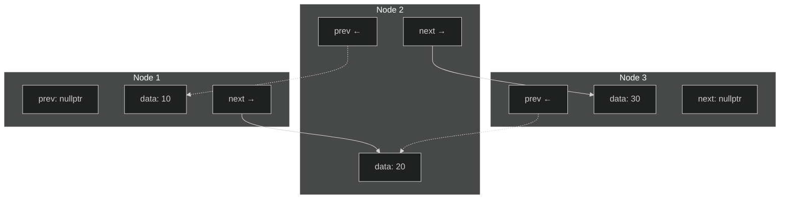
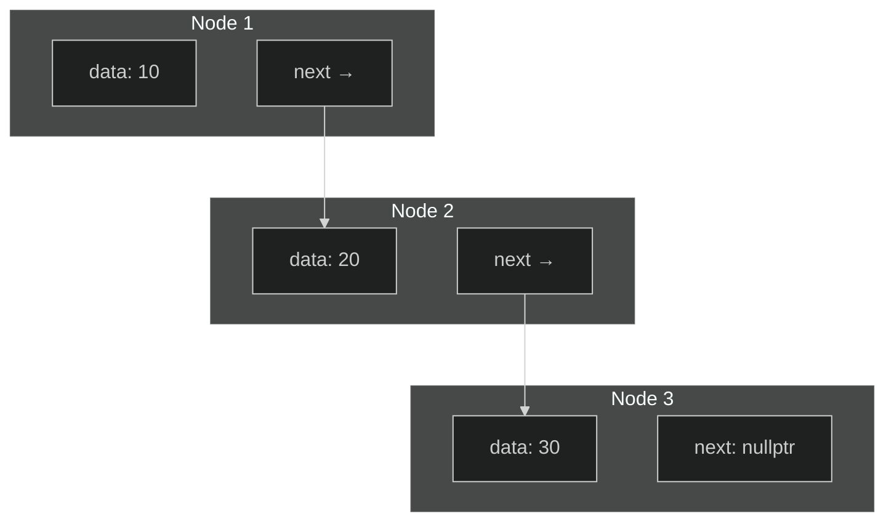

In STL presented 3 types of container:
* *Sequential containers* - data is stored in an order which is determined by the program. The order doesn't depend on its value and data will remain in the same position unless the program performs some action which changes them (move, reallocation etc). 
Those containers are `std::array`, `std::vector`, `std::list`, `std::forward_list`, `std::deque`, (`std::implace_vector` and `std::hive` which planned in C++26), from some perspective `std::string`,  (and `std::valarray`, `std::initializer_list`, `std::bitset` but they don't have iterators).
* *Associative containers* - data order depends on the data to provide better search (using red-black tree or hash tables). 
In C++ provided two types of associative containers, `std::set` which have only sorted unique keys and `std::map` which represents pair key-value. Beside that exist  `unorded_` modification, which uses hash tables for keys for faster search, but not sorted (`std::unorded_map`, `std::unorded_set`). And also exists multi-modification, (`std::multiset`, `std::multimap`, `std::unorded_multiset`, `std::unorded_multimap`), which allow non-unique keys. 
* *Containers adapters* - provide some different interface using sequential containers.
Examples are `std::stack`, `std::queue`, `std::priority_queue`, `std::flat_set`, `std::flat_map`, `std::flat_multiset`, `std::flat_multimap`. 

```sheet
{
    classes: { 
        yes: { "color": "white", backgroundColor: "#4DAA5F" },
        no: { "color": "white", backgroundColor: "#D32F2F" },
        la: { "text-align": "left" }
    }
}
--- ~ { "text-align": "center" }
| Container                | After **insertion**, <br>are **references** valid? | After **insertion**, <br>are **iterators** valid? | After **erasure**, <br>are **references** <br>and **iterators** valid? | Conditionally |
| ------------------------ | ---------- | ---------- | ----------------------------- | ----------------------------------------------------------------------------- |
| `std::array` ~.la        | N/A        | <          | N/A                           |                                                                               |
| `std::vector` ~.la       | No ~ .no   | <          | N/A                           | Insertion changed capacity                                                    |
| ^                        | Yes ~ .yes | <          | Yes                           | Before modified element(s) <br>(for insertion only if capacity didn't change) |
| ^                        | No ~ .no   | <          | No ~ .no                      | At or after modified element(s)                                               |
| `std::deque` ~.la        | No ~ .no   | Yes ~ .yes | Yes, except erased element(s) | Modified first or last element                                                |
| ^                        | No ~ .no   | <          | No ~ .no                      | Modified middle only                                                          |
| `std::list` ~.la         | Yes ~ .yes | <          | Yes, except erased element(s) |                                                                               |
| `std::forward_list` ~.la | Yes ~ .yes | <          | Yes, except erased element(s) |                                                                               |
| `std::set` <br>`std::multiset` <br>`std::map` <br>`std::multimap` ~.la | Yes ~ .yes | < | Yes, except erased element(s) |  |
| `std::unordered_set` <br>`std::unordered_multiset` <br>`std::unordered_map`<br>`std::unordered_multimap` ~.la  | No ~ .no  | Yes ~ .yes | N/A | Insertion caused rehash |
| ^                        | Yes ~ .yes | <          | Yes, except erased element(s) | No rehash                                                                     |
```

## Sequential containers
### Built-in array
C++ has a inherited from C array. 
`{cpp} int arr[] = {1, 2, 3};`
It's faster than `std::vector`, directly compatible with C code, can be allocated both on heap and stack. 
But it have serious disadvantages: 
* No direct way to find number of elements, either store separately or calculate each time.
* "Silent" conversion to pointer.
* Arrays can't be assigned ti each other.


### std::array
>[!code-ref]
>```cpp
>template<class T, std::size_t N> 
>struct std::array;
>```

`std::array` is  a templated wrapper for Built-in arrays, defined in `<array>`. 

`std::array` require two template arguments, elements type and number of elements. Number of elements also part of the object and using an array with wrong number of elements (for example, in function argument parameter) will give a compiler error. It has a similar interface to STL containers, while retaining the speed of build-in arrays, doesn't automatically decay to pointer, retains information about its size and supports iterators. 

An `std::array` object can only be created on the stack, number of elements must be known at compile time, a contiguous block of memory will be allocated to store the elements.
Unlike other containers, the default constructor creates a fully-sized object with default-initialized elements, while other containers 'empty'.

Starting from C++17 it's possible to skip template parameter specification when providing initial values in initialization, complier will use template argument deduction. 
```cpp
#include <array>

std::array<int, 5> arr {1, 2, 3, 4, 5};
std::array f_arr {1.0f, 2.0f, 3.0f, 4.0f, 5.0f};
```

Iterators of `std::array` are *Random Access Iterators* and *Contiguous Iterators* (from C++20 also *Contexpr Iterators*). 

#### Interface
+ `{cpp} operator=(std::array other)` - Overwrites every element if the array with the corresponding elements of another array 
+ `{cpp} .size() -> std::size_t` - Returns number of elements >
	Complexity - $O(1)$
+ `{cpp}.empty() -> bool` - Return `true` if container is empty.>
	Complexity - $O(1)$
+ `{cpp}operator[](std::size_t pos) -> T&` / `{cpp}operator[](std::size_t pos) const -> const T&` - Access element by index without bounds checking.
	Complexity - $O(1)$
	Never inserts a new element into the container. 
+ `{cpp}.max_size() const -> std::size_t` - Return maximum number of elements (`N`)
	Complexity - $O(1)$
+ `{cpp}.at(std::size_t pos) -> T&` / `{cpp}at(std::size_t pos) const -> const T&` - Access element by index with bounds checking. 
	Complexity - $O(1)$
	Throw `std::out_of_range` exception.
+ `{cpp}.front() -> T&` / `{cpp}.front() const -> const T&` - Get first element
	Complexity - $O(1)$
	Equivalent to `{cpp}*arr.begin()`
	*UB* for empty container.
+ `{cpp}.back() -> T&` / `{cpp}.back() const -> const T&` - Get last element. 
	Complexity - $O(1)$
	Equivalent to `{cpp}*std::prev(arr.end())`.
	*UB* for empty container.
+ `{cpp}.data() -> T*` / `{cpp}.data() const -> const T*` - Return a pointer to underlying array (C-style array)
	Complexity - $O(1)$
+ `{cpp}.fill(const T& value) -> void` -  Assign all elements to `value`
	Complexity - $O(N)$
+ `{cpp}void .swap( std::array& other) -> void` - Swaps the content of the containers with `other`.> 
	Complexity - $O(N)$.
	`{cpp}noexcept(std::is_nothrow_swappable_v<T>)`
+ Get iterators, support all type of iterators
	+ `iterator`: `{cpp}.begin()` and `{cpp}.end()`
	+ `const_iterator`: `{cpp}.cbegin() const` and `{cpp}.cend() const`
	+ `reverse_iterator`: `{cpp}.rbegin()` and `{cpp}.rend()`
	+ `const_reverse_iterator`: `{cpp}.crbegin() const` and `{cpp}.crend() const`
	 Complexity - $O(1)$

Non-member functions
+ Lexicographical elements compare, all variations of `std::operator...`
	Complexity - $O(1)$
+ `{cpp}get<I>(std::array a) -> T&` - Extract `I` element using tuple-like interface. 
	+ `{cpp}get<I>(std::array a) -> T&`
	+ `{cpp}get<I>(std::array a) const -> T&& `
	+ `{cpp}get<I>(std::array a) -> const T&`
	+ `{cpp}get<I>(std::array a) const -> const T&&` 
	Using `std::` namespace not required, can be used for both set and get values. 
	```cpp
	std::array<int, 5> arr {1, 2, 3, 4, 5};
	get<0>(arr) = 6, get<1>(arr) = 0; // set arr[0] and arr[1]
	```
	Complexity - $O(1)$

+ `{cpp}std::to_array<T>(T (&a)[N]) -> std::array` / `{cpp}std::to_array<T>(T (&&a)[N]) -> std::array ` _(C++20)_ - Create `std::array` from C-array. 
	```cpp
	auto a1 = std::to_array("foo"); // size() == 4 since also contain null-terminator
	auto a2 = std::to_array({0, 2, 1, 3});
	auto a3 = std::to_array<long>({0, 1, 3});
	```


### std::vector
>[!code-ref] `<vector>`
>```cpp
>template<class T, class Allocator = std::allocator<T>>
>class std::vector
>```

`std::vector` is resizable container in C++. TBA

#### Interface
+ `{cpp}operator=` - assigns values to the container   
+ `{cpp}.assign(std::size_t count, const T& value) -> void` / `{cpp}.assign(InputIt first, InputIt last) -> void` / `{cpp}.assign(std::initializer_list<T> ilist) -> void` - assigns values to the container
	Complexity - $O(1)$
+ `{cpp}.assign_range(R&& rg) -> void` _(C++23)_  - assigns a range of values to the container   
+ `{cpp}.get_allocator()`- returns the associated allocator   
+ `{cpp}.at(std::size_t pos) -> T&` / `{cpp}.at(std::size_t pos) const -> const T&` - access specified element with bounds checking   
	Complexity - $O(1)$
	Can throw`std::out_of_range` if pos >= size(). 
+ `{cpp}.operator[]`- access specified element   
	Complexity - $O(1)$
+ `{cpp}.front() -> T&`/`{cpp}.front() const -> const T&`- access the first element   
	Complexity - $O(1)$
+ `{cpp}.back() -> T& `/`{cpp}.back() const -> const T& `- access the last element   
	Complexity - $O(1)$
+ `{cpp}.data() -> T*`/`{cpp}.data() const -> const T*`- direct access to the underlying contiguous storage   
	Complexity - $O(1)$
+ Get iterators, support all type of iterators
	+ `iterator`: `{cpp}.begin()` and `{cpp}.end()`
	+ `const_iterator`: `{cpp}.cbegin() const` and `{cpp}.cend() const`
	+ `reverse_iterator`: `{cpp}.rbegin()` and `{cpp}.rend()`
	+ `const_reverse_iterator`: `{cpp}.crbegin() const` and `{cpp}.crend() const`
	Complexity - $O(1)$
+ `{cpp}.empty() const -> bool` - return `true` if vector is empty 
	Complexity - $O(1)$
+ `{cpp}.size() const -> std::size_t` - returns the number of elements   
	Complexity - $O(1)$
+ `{cpp}.max_size() const -> std::size_t` - returns the maximum possible number of elements 
	Complexity - $O(1)$
+ `{cpp}.reserve(std::size_t new_cap)` - reserves storage  
	Complexity - $O(N)$
+ `{cpp}.capacity() const -> std::size_t` - returns the number of elements that can be held in currently allocated storage   
	Complexity - $O(1)$
+ `{cpp}.clear() -> void` - clears the contents    
	Complexity - $O(N)$
+ `{cpp}.insert() -> iterator` - inserts elements and return iterator to inserted element
	+ `{cpp}.insert(const_iterator pos, const T& value)
	+ `{cpp}.insert(const_iterator pos, T&& value)`
	+ `{cpp}.insert(const_iterator pos, std::size_t count, const T& value)`
	+ `{cpp}.insert(const_iterator pos, InputIt first, InputIt last)`
	+ `{cpp}.insert(const_iterator pos, std::initializer_list<T> ilist)`
	Complexity - $O(N)$
+ `{cpp}.insert_range(const_iterator pos, R&& rg) -> iterator` _(C++23)_ - inserts a range of elements   
	Complexity - $O(N)$
+ `{cpp}.emplace(const_iterator pos, Args&&... args) -> iterator`- constructs element in-place  and return iterator to emplaced element
	Complexity - $O(N)$ 
+ `{cpp}.erase() -> iterator` - erases elements and return iterator following the last removed element.
	+ `{cpp}.erase(iterator pos) -> iterator`
	+ `{cpp}.erase(const_iterator pos) -> iterator`
	+ `{cpp}.erase(iterator first, iterator last) -> iterator`
	+ `{cpp}.erase(const_iterator first, const_iterator last) -> iterator`
	Complexity - $O(N)$
+ `{cpp}.push_back(const T& value) -> void`/`{cpp}.push_back(T&& value) -> void` - adds an element to the end  
	Complexity - *Amortized* $O(1)$ (if reallocation not required)
+ `{cpp}.emplace_back(Args&&... args) -> void/T&` - constructs an element in-place at the end. From C++17 return reference to inserted element
	Complexity - *Amortized* $O(1)$ (if reallocation not required)
+ `{cpp}.append_range(R&& rg) -> void` _(C++23)_  - adds a range of elements to the end  
	Complexity -  $O(N)$
+ `{cpp}.pop_back() -> void` - removes the last element 
	Complexity - $O(1)$
	*UB* if vector is empty.
+ `{cpp}.resize(std::size_t count, const T& value = {}) -> void` - changes the number of elements stored and copies `value`.
	Complexity - $O(N)$
+ `{cpp}.swap(std::vector& other) -> void` - swaps the contents    
	Complexity - $O(1)$

+ `{cpp}operator==`
+ `{cpp}std::swap(std::vector)`
+ `{cpp}std::erase(std::vector)`, `{cpp}std::erase_if(std::vector)` _(C++20)_


### Lists
#### std::list
The C++ Standard Library `std::list` is implementation of double-linked lists. 

In a double-linked list each node has a link to the previous node as well as to the next node. Memory stored not contiguous. A double-linked list can be easily traversed backwards and forwards by the following the pointers in each node. 
Inserting and removing elements done via changing corresponding `next`/`prev` pointers.


List of some Pros and Cons:
* Adding or removing elements from the middle of a list is faster than for `std::vector`
* List are useful where we expected to add or remove a lot of elements frequently. 
* List don't support indexing or subscript notation, it doesn't support random access. 
* Accessing an element is slower than for `std::vector`
* List use more memory to store an element than `std::vector`.

#####  Interface
+`{cpp} .push_back()` / `{cpp}.push_front()` - Add element to the end/beginning of container. 
+ `{cpp}.remove(const T& value) -> void/std::size_t`, `{cpp}.remove_if(UnaryPred p) -> void/std::size_t` - Remove elements equal to given `value` or satisfy unary predicate `p`. 
	Since C++20 return number of elements removed. 
	Compare to generic `std::remove` actually remove elements, not moving them to end. 
	Complexity: $O(N)$
+ `{cpp}.sort(Compare comp = operator<) -> void` - Sort the elements in order based on `comp` operator. 
	Generic `std::sort()` will not work with `std::list` since it's require Random Access Iterators. For sorting only available member function. 
	Complexity $O(N* logN)$
+ `{cpp}.reverse` - Reverse the order of the elements 
+ `{cpp}.unique()` - Deletes duplicate elements from the list
+ `{cpp}.merge(std::list& other)` -  Remove elements from the argument list and perform stable merge them into `this` list. 
	Method expect *sorted* lists. If one of container is not sorted - *UB*. 
+ `{cpp}.splice()` -  Moves elements from another list or one element into a list.
	All elements from another list will be inserted before given iterator. 


### std::forward_list
`std::forward_list` is non-contiguous sequential container representing one-directional list implementation. 


In a list, each element has its own memory allocation "node", each node contains data and pointer to next node. To iterate through a list, we start with the first node, get its link pointer and go to the address in that link pointer, which is location of the second node. To add element required to create a node for it, make the link from the node before point to the new node, then make the new node's link point to the node after. Removing an element require to make the previous node link point to the next node. 

`std::forward_list` doesn't have `{cpp}insert()` or `{cpp}erase()` member functions, instead used `{cpp}insert_after()` and `{cpp}erase_after()`. 

Also instead `{cpp}.splice()` from `std::list`  `std::forward_list` implements `{cpp} .splice_after()` member functions. It's work similarly, but elements are spliced in after the iterator argument instead of before it. 


#### Note about choosing
Lists are much slower than vector and deque for most operations, uses more memory. However list is much faster at adding and removing elements, but only if this doesn't involve searching (meaning that when iterators known before inserting or deleting element). Also, changing element doesn't invalidate other iterators and pointers. 
> `std::forward_list` have less resources consumptions than `std::list`:  less memory per node, less action on insertion.


### std::deque 
`std::deque` implements a double-ended queue, defined in `<deque>`

Similar to a vector, but elements can also be added efficiently both at the front and at the end. (In `std::vector` inserting into front will trigger shifting all elements to the right, which cost $O(N)$. Also, inserting into `std::vector` at the end not always $O(1)$ - in some cases capacity can be not enough and `std::vector` will perform reallocation, which will move all elements from old allocation to new. In `std::deque` *inserting in both front and back always O(1)*)

`std::deque` implemented as two-dimension array - it has multiple memory block which each store several elements. Memory storage *not contiguous*.  Iterating from the first element of the first block to the last element of the last block will return all the elements in order. If there is not enough room to store a new elements, the deque will allocate memory block and store new elements in there. The existing elements remain where they are.

Interface is similar to `std::vector`, in addition also have `{cpp}.push_front()` member function which inserts an element before the first block. 

> `std::queue` is container adapter, typically uses `std::deque` or `std::list`. So, if `std::forward_list` is 'stripped off version with half of functionality for reducing overhead', `std::queue` is not lightweight version. 

Deque is slightly slower than vector for most operations. However, it is faster than vector for adding and removing elements at the front of the container. Deque doesn't invalidate *references when inserting/removing last or first element*, however iterators might be invalidated and references when modifying  middle of container. 


## Ordered associative containers
C++ associative containers are implemented using  tree-structure. This is a data structure in which each element has its own node, a node has a _key_ for the element and two pointer  _left_ and _right_. The positions of elements depends on the relative values of their keys: "left" points to an element which has a lower key, "right" points to an element which has a higher key. 

Main advantage of this data structure is that search for key is much faster (usually $O(logN)$). Also adding element is fast enough since it's require similarly to list require only to allocate new node and assign correct pointers. As disadvantage trees can after several inserting and erasing become "unbalanced", meaning slowing operation and might require rebalancing. This problem solved in 'balanced trees' which automatically rebalance themselves when needed, examples are "Red-black tree" or "AVL tree".


### std::set
A `std::set` from `<set>` is an minimalistic implementation of associative container in STL with only key. It's an unstructured collection of elements, all elements are unique and sorted with `{cpp}operator<` by default. To meet standard requirements it's implemented as *red-black tree*.

`std::set` doesn't have `{cpp}.push_back()`/`{cpp}.push_front()` functions (since elements not in order they inserted), instead  for elements insertion  used `{cpp}.insert()`.  For removing element used member function `{cpp}.erase()`. Before inserting/removing element `std::set` can check is tree is balanced, if not - rebalance tree firstly before operation. 

The elements in `std::set` are `const`, since container itself maintain order meaning that changing elements can break that order. This also implies some limitations on algorithms compatible with `set`. 

Attempt to insert element which already exist will fail.  `{cpp}.insert()` also return `{cpp}std::pair<itr, bool>`, second element of pair is flag "was element inserted" and first is iterator to inserted element or existing element if insertion failed. Starting from C++17 it's possible to use structured binding for returned pair:
```cpp
std::set ids {0, 100};

auto [itr, isInserted] = ids.insert(100);
if (!isInserted)
	std::cout << "ID already exists\n";
```

`{cpp}.find(k)` member function returns an iterator to the element with key `k` or `{cpp}.end()` if `k` is not found. Also, can be used `{cpp}.count(k)` to check is `k` exist in set or not - function return the number of elements with key, but since duplicates not allowed, this can only be 0 or 1.

`std::set` relatively fast at accessing an arbitrary element ($O(logN)$, since require to iterate tree from root). Insertion and deletion are usually very fast ($O(logN)$). Useful for checking membership or removing duplicates, automatic sorting and removing duplicates.
> However, filling `std::set` for only sorting purposes is equal to `std::vector` + `std::sort`,  both $O(N log N)$ 


### std::map
`std::map` is an associative container provided in `<map>`. Each element consists of an `{cpp}std::pair<Key, Value>`. Each element must have a unique key, elements are stored in order using `operator<` by key. For efficiency usually implemented as *red-black tree*.

The "value" member of the pair is used to store the data, values can repeat, only keys must be unique. The "key" is used to locate the corresponding data, it's used for look up the data in the value member and used in `{cpp}.operator[]`/`{cpp}.at()` member functions, so key acts like an index, but key have any type. 

To insert new element we need to make pair first. It'a either `{cpp}.insert(std::make_pair(k, v))` or using C++11 initializer list `{cpp}.insert({k, v})`. Similarly to `std::set` insertion return pair with iterator of element and flag, which will be false if we try to insert key which already presented. 

Also similarly to set, we can use `{cpp}.find()` and `{cpp}.count()` member functions, similarly key is `const`.

Unlike list and set, `std::map` supports subscripting (meaning that `{cpp}operator[]` available) , however this works differently from vector and arrays. If key not would in `std::map` when assigning value - *new element will be created*, if element does exist, this overwrites its value.  

Inserting with `{cpp}operator[]` has own disadvantages. Value type must have default initialization, from operation itself we can't tell is element was overwritten or created. Also if exception thrown - we can end up with key which has invalid data. So it's recommended to use `{cpp}.insert()` and check - if it's failed - using returned operator modify value. In C++17 also available `{cpp}.insert_or_assgin()`, which works as `{cpp}opertator[]`, but return `std::pair`, exception has no effect on insertion and value doesn't need to have a default constructor. 

Similarly to set, for `std::pair` handful to use structured bindings (C++17). Structured bindings useful not only for inserting values, but also in range-for loop since during iterating we will get `std::pair`. 
```cpp
std::map<std::string, int> counter {{"apple", 0}, {"banana", 0}};
counter["apple"]++;
for (const auto& [name, count] : counter)
	std::println("{} have {} elements", name, count);
```
> Important thing - key in pair always constant. Using `const auto [k, v]` can create copy, since auto will deduct type `k, v`, not `const k, v`.  With references it works correctly and no redundant copy is made. 

#### Notes about choosing 
As for `std::set`, insertion, finding and erasing have complexity $O(log N)$, and since both use red-black tree, unique sorted keys - characteristics are same. Maps useful for indexed data (contact list, employee records, database query results etc), for storing data which is in the form of key-value pairs (JSON, XML, etc). 


### std::multiset and std::multimap
In general `std::multimap` and `std::multiset` works same as `std::map` and `std::set`, located in same header files, but with support of duplicated keys.

Since insertion can't fail due to key duplication, `{cpp}.insert()`/`{cpp}.emplace()` functions return only iterator to inserted element (instead `std::pair<itr, bool>`). Also`std::multimap` doesn't support subscripting (`{cpp}operator[]`) and `{cpp} .insert_or_assign()`.

`{cpp}.erase()` will remove all elements with given key. Single element key be removed by passing iterator as an argument.
`{cpp}.find(key)` will return an iterator to the first element with `key`. Elements with same key will close to each other since keys are sorted, and with `{cpp}.count(key)` can be found "length" of subrange of element with same key.
>But overall complexity will $O(log n) + O(log n + k) = O(log n + k)$ 

`std::multimap` and `std::multiset` also provide member function to determine subrange of elements with equal keys: `{cpp}.lower_bound(key)` and `{cpp}.upper_bound(key)`, which returns iterators representing half-opened range of iterators to all the elements with `key` (`{cpp}[lower_bound(), upper_bound())`, similar to `{cpp}[begin(), end())`).
>Complexity $O(log n) + O(log n) = O(log n)$ 

Best way to get subrange of elements with equal key is use member function `{cpp}.equal_range(key)` which return`std::pair` with iterators to begin and end of subrange. 
>Complexity $O(log n)$, single pass.

>Generic `{cpp}std::lower_bound()`, `{cpp}std::upper_bound()`,`{cpp}std::equal_range()` will not work with `std::map` and `std::multimap` since algorithms will capture `std::pair<K, V>`.  
>It's possible though to find element with `{cpp}std::find(std::begin(map), std::end(map), std::make_pair(Key, Value));`, but complexity will be much likely $O(n)$ since `std::find` will iterate through map (with complexity $O(n)$) instead "finding" with complexity $O(log n + k)$
>With `{cpp}std::lower_bound()` even though it's "binary search" - it will give $O(log n)$ complexity for [Random Access Iterators](https://en.cppreference.com/w/cpp/algorithm/lower_bound.html#Complexity),  associative containers doesn't meet this requirements and as  *Forward iterators* complexity will be $O(N)$ due to iterations.

This only give as search by key only. In `std::multimap` we probably need also search by value - this can be done with `std::find_if` as an option. 
```cpp
auto [begin, end] = map.equal_range(key);
auto result = std::find_if(begin, end, [](const auto& element) { return element.second == 3; });
    
if (result == end)
	// value not found
```
If we need to continue search - we can take next iterator after `result` and use that iterator as a `begin` of `{cpp}find_if()`.


## Unordered Associative Containers
Regular `std::map`, `std::set` and `std::multi-`modifications uses red-black tree. There are also `std::unordered_`  modification to all 4 containers in `<unordered_map>` and `<unordered_set>` headers. `std::unordered_` uses *hash tables* instead trees for keys. `Unordered` containers doesn't provide any sorting feature or keeps sequence in which elements was added - they design for efficient searching. 

A hash table in C++ is an arrays of "buckets". Buckets in general are linked lists. Inside linked list are pointer to actual arrays. A hash function computes and index into an array of buckets. 
>[!note] So, calculation of bucket index looks something like this:
>1. Calculate hash from key, `{cpp}std::size_t hash_value = std::hash<Key>{}(key);`
>2. Calculate index `{cpp} std::size_t index = hash_value % bucket_count`, sometimes instead MOD operator used *bit mask* since `bucket_count` is some power of 2: `{cpp} std::size_t index = hash_value & (bucket_count - 1)`

Buckets amount determined by *load factor*: $a = \frac{size}{bucket\_count}$, by default maximum load factor is equal to 1.0. When load factor become greater than 1.0 - insertion will trigger _rehashing_: creating new buckets array with greater size, each element from old array moved to new array according to new index value. This operation is $O(n)$. But in most cases insertion is $O(1)$ and usually called as _amortized_ complexity. 

Searching of element in container require calculating hash and index, which as result give $O(1)$ search. 

For maximum efficiency, each element should have its own bucket, which require "perfect hashing" - each key produces a different hash value. In this case linked list not required, which is resulting that maximum efficiency. In practice, different keys sometimes give the same hash number, so-called *hash collision*. Also, `std::multi-` allow several elements with same key, so they probably will be in same bucket. The more elements there are in a bucket, the longer it will take to perform an operation which involves that bucket due to linked list operations. 
> Besides that, with STL unordered maps have performance issues due to *cache misses*: modern CPU uses L1 and L2 caches while working with value. In `std::unorded` we firstly need access bucket, then to list element, and after than - go to address in pointer. If required value not found in L1 cache - it will be search in L2 cache, then in RAM, CPU will wait until required value will not be loaded to L1 cache - at the end we get slower operations than in theory. Modern CPU design for sequential data, which is why `std::vector` can be faster in operations where both containers have similar $O(N)$ complexity.  There are some implementation of maps which aimed to solve hash collision (Google Abseil, Tessil's Robin Hood Hashing) but they don't provide similar to STL maps iterator and references stability. 

`std::unordered` containers only allow *Forward Iterators*, as result `{cpp}rbegin()` and `{cpp}rend()` not supported. Also, `{cpp} lower_bound()` and `{cpp}upper_bound()` not supported, for`std::multi-` yet available `{cpp}equal_range()`. 


### Working with custom types 
Custom types here meaning any class, used as a key. When working with own classes, we have to provide required function in order to be able to use own class with associative container. 

Ordered associative containers use `{cpp}operator<` of their keys to sort their elements. If class doesn't have `{cpp}operator<`, compiler will give and error.
For Unordered associative containers required to provide specialization of `{cpp}std::hash<T>` and defined `{cpp}operator==`. 

In C++ in general can be highlighted 3 meanings of "being equal":
* _Identity_ - the object occupies the same memory, but are referred to differently (different pointers/references).
* _Equality_ - the object occupies different memory, but have the same value 
* _Equivalence_ - "important" values are the same, but "unimportant" may differ. 


## Container Adapters 
### std::queue 
A queue is a data structure in which elements are stored in the order in which they are inserted. As a queue is processed, the element at the front is removed and the element behind it move to the front. When new elements are added to the queue, they are inserted at the back. Elements can only be removed from the front, in the same order they were added. 

C++ has an _FIFO_ `std::queue` implementation in`<queue>`. A `std::queue` usually use as underlying container `std::deque`, although it can use  `std::list`. `std::deque` selected due to lots of removing from the front of container. 
Queues are mainly used for temporary storing data in the order it arrived (network data). 

`std::queue` have limited interface to meet some requirements to container and from some point restricts functionality of underlaying container.

#### Interface
+ `{cpp}.front()` - Returns the element at the front 
+ `{cpp}.back()` -  Return element at the back
+ `{cpp}.empty()` - Returns `true` if there are no elements
+ `{cpp}.size()` - Returns the number of the elements
+ `{cpp}.push()` - Add an element to the back
+ `{cpp}.push_range()` - _(C++23)_ Add range of elements at the back 
+ `{cpp}.emplace()` - Construct element in-place at the back
+ `{cpp}.pop()` - Remove the element from the front 
+ `{cpp}.swap(std::queue& other)` - Swaps with `other` queue
+ every `operator` variation 
+ `{cpp} std::swap()`


### std::priority_queue 
>[!code-ref] `<queue>`
>```cpp
>template<class T, class Container = std::vector<T>, class Compare = std::less<typename Container::value_type>>
>class std::priority_queue;
>```

A priority queue is very similar to a queue, but it's orders its elements with the "most important" at the front.
In C++ its implemented as `std::priority_queue` from `<queue>` header, it uses `{cpp} operator<` to sort elements in order. It uses by default `std::vector`, but also can use `std::deque`. 

`std::priority_queue` has a similar interface to `std::queue`, only difference is that for access elements available only `{cpp}.top()` instead of `{cpp}.front()` and `{cpp}.back()` and there is no support of `operator` non-member functions. 

Priority queues are useful for processing data which needs to be prioritized: Operating system schedulers, "out-of-band" communication in networking, management system for bug reports etc. 

#### Interface 
+ `{cpp}.top() const -> const T&` -  Return element with highest priority
+ `{cpp}.empty() const -> bool` - Returns `true` if there are no elements
+ `{cpp}.size() const -> std::size_t` - Returns the number of the elements
+ `{cpp}.push(const T& value) -> void`/`{cpp}.push(T&& value) -> void`  - Add an element
+ `{cpp}.push_range(R&& rg) -> void` - _(C++23)_ Add range of elements 
+ `{cpp}.emplace(Args&&... args) -> decltype(auto)`  - Construct element in-place, from C++17 return what returned above call to `Container::emplace_back` 
+ `{cpp}.pop() -> void` - Remove the element from the front 
+ `{cpp}.swap(std::priority_queue& other) -> void` - Swaps with `other` queue
+ `{cpp} std::swap()` - non-member swap function


### std::stack
>[!code-ref] `<stack>`
>```cpp
>template<class T, class Container = std::deque<T>>
>class std::stack;
>```

A stack is a data structure in which elements are stored in the order in which they are inserted. When new elements are added to stack, they are inserted at the top. Only the element at the top can be accessed. As a stack is processed, the element  at the top is removed and the element below it becomes the top. This is also called _LIFO_ structure. 

The C++ `std::stack` presented in `<stack>` header, it's using by default as underlaying container `std::deque`, also possible to use `std::vector`, `std::list` and. `std::vector<bool>`. 

Interface similar to `std::priority_queue`, but `std::stack` supports `operator` non-member overloads. 

Stacks have many applications in parsing expressions in compilers, checking for unbalanced parentheses, implementing "undo" functionality, storing history for back/forward buttons in web browser etc. 

#### Interface
+ `{cpp}.top() -> T&` / `{cpp}.top() const -> const T&` -  Return element at the top
+ `{cpp}.empty() const -> bool` - Returns `true` if there are no elements
+ `{cpp}.size() const -> std::size_t` - Returns the number of the elements
+ `{cpp}.push(const T& value) -> void`/`{cpp}.push(T&& value) -> void`  - Add an element to the top
+ `{cpp}.push_range(R&& rg) -> void` - _(C++23)_ Add range of elements 
+ `{cpp}.emplace(Args&&... args) -> void`  - Construct element in-place
+ `{cpp}.pop() -> void` - Remove the element from the top 
+ `{cpp}.swap(std::priority_queue& other) -> void` - Swaps with `other` queue
+ `{cpp} std::swap()` - non-member swap function
+ Lexicographical elements compare, all variations of `std::operator...`
	Complexity - $O(1)$
