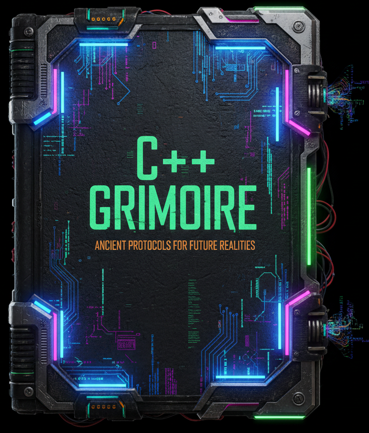

# Behold not Mighty C++ Grimoire 

Simply, this is my obsidian vaults with note which I make during C++ learning over ages. Initially notes was in docx file, however obsidian looks more flexible, faster, convenient (for code-style highlight for example), plus git allow to track activity.

Why take notes, especially for books or video materials - I see this as a hack for my mind. I get used to believe that I have great skills in problem solving through searching for information: I can filter information, skip lines of text, formulate search query - to achieve desired result for given problem. At the end, found information can hold in brain not long time, it's stored on _stack_ and destroyed after leaving the _scope_ of problem - when it's might require to solve problem once again - definitely same solution will be found once again. Such _runtime behavior_ makes learning a little bit challenging - information just _leak like a raw pointer_: reading some book or watching some conference video, utilize one repeated problem - finish (to get some new information) - brain can start to skip information/destruct to some other things etc. Adding in learning "quest list" notetaking set additional problem to solve during learning process - highlight important information, reinterpret it in more understandable way and also type it (which is third time in row repeating same information).   

Therefor, this vault is for track my learning amplitude and reinforce commits frequency, collect note for myself as footprint for quick reference in future

